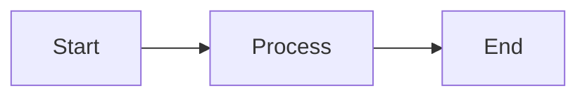

# Documentation Structure Guide

This guide provides a complete reference for organizing, creating, and maintaining documentation for the NexusNews project.

## 📁 Directory Structure

### Current Structure

```
docs/
├── .vitepress/              # VitePress configuration
│   ├── config.js            # Main configuration
│   ├── theme/               # Custom theme files
│   └── cache/               # Build cache (gitignored)
│
├── index.md                 # Documentation homepage (REQUIRED)
├── README.md                # Documentation guide (this file)
│
├── architecture/            # System Architecture Documentation
│   ├── index.md             # Architecture overview (REQUIRED)
│   ├── news-sources.md      # Multi-source adapter pattern
│   ├── ai-integration.md    # OpenRouter AI architecture
│   ├── data-management.md   # Room, DataStore, caching
│   └── dependency-injection.md # Hilt setup
│
├── development/             # Development Guides
│   ├── index.md             # Development overview (REQUIRED)
│   ├── setup.md             # Environment setup guide
│   ├── coding-style.md      # Code standards
│   ├── testing.md           # Testing strategies
│   ├── git-workflow.md      # Git conventions
│   └── contributing.md      # Contributing guide
│
├── api/                     # API Documentation
│   ├── index.md             # API overview (REQUIRED)
│   ├── dependencies.md      # Complete dependency reference
│   ├── newsapi.md           # NewsAPI integration
│   ├── guardian.md          # Guardian API integration
│   ├── openrouter.md        # OpenRouter AI API
│   └── scraping.md          # Jsoup web scraping guide
│
├── project/                 # Project Management
│   ├── index.md             # Project overview (REQUIRED)
│   ├── overview.md          # High-level summary
│   ├── prd.md               # Product Requirements Document
│   └── roadmap.md           # Development roadmap
│
├── weekly/                  # Progress Tracking
│   ├── index.md             # Weekly reports overview (REQUIRED)
│   ├── week-1.md            # Week 1 report
│   ├── week-2.md            # Week 2 report
│   └── week-N.md            # Additional weeks
│
├── ai-context/              # AI Agent Context
│   ├── index.md             # Structured project metadata (REQUIRED)
│   └── linking.md           # Context linking guide
│
└── public/                  # Static assets
    └── assets/              # Images, logos, etc.
```

## 🏗️ Hierarchy Levels

### Level 1: Category Index Files (REQUIRED)

Each category MUST have an `index.md` file:
- `architecture/index.md`
- `development/index.md`
- `api/index.md`
- `project/index.md`
- `weekly/index.md`
- `ai-context/index.md`

**Purpose**: Serve as landing pages and navigation hubs for each category.

### Level 2: Topic Pages

Detailed documentation on specific topics within each category.

**Examples**:
- `architecture/news-sources.md`
- `development/setup.md`
- `api/dependencies.md`

### Level 3: Sub-Topics (Optional)

For very complex topics, you can create subdirectories:

```
api/
├── index.md
├── dependencies.md
├── integrations/
│   ├── newsapi.md
│   ├── guardian.md
│   └── openrouter.md
└── scraping/
    ├── hbvl.md
    └── gva.md
```

## 📝 File Naming Conventions

### Rules

1. **Lowercase only**: `news-sources.md`, not `News-Sources.md`
2. **Hyphens for spaces**: `ai-integration.md`, not `ai_integration.md`
3. **Descriptive names**: `setup.md` is better than `guide.md`
4. **Avoid abbreviations**: `dependencies.md`, not `deps.md` (unless widely known)
5. **Index files**: Always `index.md`, not `readme.md` or `overview.md` at category root

### Naming Patterns

| Type | Pattern | Example |
|------|---------|---------|
| Category Index | `index.md` | `architecture/index.md` |
| Guide | `{topic}.md` | `setup.md` |
| Reference | `{topic}-reference.md` | `api-reference.md` |
| Tutorial | `{topic}-tutorial.md` | `hilt-tutorial.md` |
| Concept | `{concept}.md` | `clean-architecture.md` |

## 🔗 Linking Best Practices

### Internal Links

**IMPORTANT**: All internal links must be relative to the `/docs` directory and start with `/`.

#### ✅ Correct Linking Examples

```markdown
<!-- Link to another category index -->
[Architecture Overview](/architecture/)

<!-- Link to a specific page -->
[Setup Guide](/development/setup)

<!-- Link to a section within a page -->
[Dependencies Overview](/api/dependencies#core-dependencies)

<!-- Link from any page to homepage -->
[Documentation Home](/)
```

#### ❌ Incorrect Linking Examples

```markdown
<!-- Don''t use relative paths -->
[Setup](../development/setup)  ❌

<!-- Don''t use file extensions in links -->
[Setup](/development/setup.md)  ❌

<!-- Don''t use absolute URLs for internal links -->
[Setup](https://undead2146.github.io/NexusNews/development/setup)  ❌

<!-- Don''t forget the leading slash -->
[Setup](development/setup)  ❌
```

### External Links

Use full HTTPS URLs:

```markdown
[Android Documentation](https://developer.android.com)
[Kotlin Docs](https://kotlinlang.org/docs)
```

### Link Validation Checklist

Before committing documentation:

- [ ] All internal links start with `/`
- [ ] No `.md` extensions in links
- [ ] Category index links end with `/` (e.g., `/architecture/`)
- [ ] Specific page links have no trailing `/` (e.g., `/development/setup`)
- [ ] External links use HTTPS
- [ ] All linked files actually exist

## �� Frontmatter Template

Every markdown file MUST include frontmatter:

```yaml
---
title: Page Title                        # Required: Clear, descriptive title
description: Brief page description      # Required: 1-2 sentence summary
category: architecture|development|api|project|weekly|ai-context  # Required
lastUpdated: YYYY-MM-DD                  # Required: ISO date format
aiContext: true|false                    # Required: Is this for AI agents?
tags: [tag1, tag2, tag3]                # Optional: Relevant tags
versionsFile: path/to/file              # Optional: For dependency docs
schema: schema-name                     # Optional: For AI context files
---
```

### Frontmatter Examples

#### Architecture Document
```yaml
---
title: News Sources Architecture
description: Multi-adapter pattern for aggregating news from various sources
category: architecture
lastUpdated: 2025-11-03
aiContext: true
tags: [architecture, adapter-pattern, news-sources]
---
```

#### Development Guide
```yaml
---
title: Setup Guide
description: Step-by-step guide to set up the development environment
category: development
lastUpdated: 2025-11-03
aiContext: true
tags: [setup, getting-started, android-studio]
---
```

#### API Reference
```yaml
---
title: Dependencies Reference
description: Complete list of all project dependencies with versions
category: api
lastUpdated: 2025-11-03
aiContext: true
tags: [dependencies, libraries, gradle]
versionsFile: gradle/libs.versions.toml
---
```

## 📐 Page Structure Template

### Standard Page Template

```markdown
---
title: Your Page Title
description: Brief description
category: appropriate-category
lastUpdated: YYYY-MM-DD
aiContext: true
tags: [relevant, tags]
---

# Page Title

Brief introduction paragraph explaining what this page covers.

## Overview (Optional)

High-level summary or key points.

## Main Sections

### Subsection 1

Content here...

### Subsection 2

Content here...

## Examples (Optional)

Practical code examples or usage patterns.

## Related Documentation

- [Related Page 1](/category/page1)
- [Related Page 2](/category/page2)

## External References

- [External Resource](https://example.com)
```

### Index Page Template

```markdown
---
title: Category Name
description: Overview of category documentation
category: category-name
lastUpdated: YYYY-MM-DD
aiContext: true
---

# Category Name

Brief description of what this category covers.

## Available Documentation

### Topic 1
- **[Page Name](/category/page-name)** - Brief description
- **[Another Page](/category/another-page)** - Brief description

### Topic 2
- **[Page Name](/category/page-name)** - Brief description

## Coming Soon

- Topic that will be documented later
- Another planned topic

## Quick Links

- [Related Category](/other-category/)
- [Another Category](/another-category/)
```

## 🎯 Content Guidelines

### Writing Style

1. **Clear and Concise**: Short sentences, active voice
2. **Scannable**: Use headings, bullet points, tables
3. **Practical**: Include examples and code snippets
4. **Up-to-date**: Update `lastUpdated` when making changes
5. **Consistent**: Follow the same style across all docs

### Code Snippets

Use fenced code blocks with language specification:

````markdown
```kotlin
data class Article(
    val id: String,
    val title: String,
    val content: String
)
```
````

### Tables

Use markdown tables for structured data:

```markdown
| Column 1 | Column 2 | Column 3 |
|----------|----------|----------|
| Data 1   | Data 2   | Data 3   |
```

### Diagrams

Use Mermaid for diagrams (supported by VitePress):

````markdown

````

## 🔄 Update Protocol

### When to Update Documentation

1. **Adding a feature**: Document in relevant category
2. **Changing architecture**: Update `/architecture/` docs
3. **Adding dependencies**: Update `/api/dependencies.md`
4. **Completing a task**: Update `/project/roadmap.md`
5. **Weekly progress**: Create new `/weekly/week-N.md`

### Update Checklist

- [ ] Update the relevant documentation page
- [ ] Update `lastUpdated` in frontmatter
- [ ] Check and update cross-references
- [ ] Update index page if adding new file
- [ ] Update VitePress config if needed (sidebar)
- [ ] Test locally (`npm run docs:dev`)
- [ ] Check for broken links

### Cross-Reference Updates

When updating a page, also update pages that reference it:

| Updated File | Also Update |
|--------------|-------------|
| `/api/dependencies.md` | `/ai-context/index.md`, `/development/setup.md` |
| `/architecture/*.md` | `/ai-context/index.md` |
| `/project/roadmap.md` | `/ai-context/index.md`, latest `/weekly/week-N.md` |

## 🆕 Adding New Documentation

### Step-by-Step Process

#### 1. Choose the Right Category

| Category | When to Use |
|----------|-------------|
| `/architecture/` | System design, patterns, technical decisions |
| `/development/` | Setup, coding standards, workflows, tools |
| `/api/` | Dependencies, API integrations, external services |
| `/project/` | Requirements, roadmap, project management |
| `/weekly/` | Progress reports, weekly updates |
| `/ai-context/` | AI agent metadata (rarely modified) |

#### 2. Create the File

```bash
# Template
touch docs/category/topic-name.md
```

Example:
```bash
touch docs/architecture/navigation.md
```

#### 3. Add Frontmatter

Copy the appropriate template from above.

#### 4. Write Content

Follow the page structure template.

#### 5. Update Index Page

Add link to `docs/category/index.md`:

```markdown
- **[Your New Page](/category/your-new-page)** - Brief description
```

#### 6. Update Sidebar (if needed)

Edit `docs/.vitepress/config.js`:

```javascript
''/category/'': [
    {
        text: ''Category Name'',
        items: [
            { text: ''Overview'', link: ''/category/'' },
            { text: ''Your New Page'', link: ''/category/your-new-page'' }  // Add this
        ]
    }
]
```

#### 7. Test Locally

```bash
cd docs
npm run docs:dev
# Visit http://localhost:5173 and verify links work
```

## 🚫 Common Mistakes to Avoid

### 1. Broken Links

❌ **Wrong**: `[Setup](../development/setup.md)`  
✅ **Right**: `[Setup](/development/setup)`

### 2. Missing Frontmatter

❌ **Wrong**: Starting file with `# Title`  
✅ **Right**: Starting with YAML frontmatter

### 3. Inconsistent Naming

❌ **Wrong**: `News_Sources.MD`  
✅ **Right**: `news-sources.md`

### 4. Missing Index Files

❌ **Wrong**: Creating `docs/newcategory/page.md` without `docs/newcategory/index.md`  
✅ **Right**: Always create `index.md` first

### 5. Forgetting to Update lastUpdated

❌ **Wrong**: Editing content but not updating frontmatter date  
✅ **Right**: Update `lastUpdated: 2025-11-03` whenever you edit

## 🔍 Finding Broken Links

### Manual Check

```bash
# Search for all markdown links
grep -r ''\[.*\]('' docs/
```

### Automated Check

VitePress will warn about broken links during build:

```bash
npm run docs:build
```

## 📚 Documentation Maintenance

### Monthly Tasks

- [ ] Review all `lastUpdated` dates
- [ ] Check for broken links
- [ ] Update dependencies in `/api/dependencies.md`
- [ ] Verify all code examples still work
- [ ] Update screenshots if UI changed

### Quarterly Tasks

- [ ] Review and update `/project/roadmap.md`
- [ ] Audit all documentation for outdated content
- [ ] Update `/ai-context/index.md` with current status
- [ ] Review and consolidate duplicate information

## 🎓 Examples of Good Documentation

### Example 1: Well-Structured Index

```markdown
---
title: Architecture Documentation
description: Technical architecture and design patterns
category: architecture
lastUpdated: 2025-11-03
aiContext: true
---

# Architecture Documentation

Complete technical documentation for NexusNews system architecture.

## Core Architecture

- **[Architecture Overview](/architecture/)** - System design and layers
- **[MVVM Pattern](/architecture/mvvm)** - ViewModel implementation

## Data Layer

- **[Data Management](/architecture/data-management)** - Room, DataStore
- **[Repository Pattern](/architecture/repository)** - Data abstraction

## See Also

- [Dependencies](/api/dependencies)
- [Setup Guide](/development/setup)
```

### Example 2: Well-Structured Guide

```markdown
---
title: Testing Guide
description: Comprehensive guide to testing in NexusNews
category: development
lastUpdated: 2025-11-03
aiContext: true
tags: [testing, junit, mockk, espresso]
---

# Testing Guide

This guide covers all testing practices for NexusNews.

## Overview

NexusNews uses three types of tests:
- Unit tests (JUnit + Mockk)
- Integration tests
- UI tests (Espresso)

## Unit Testing

### Setup

\`\`\`kotlin
dependencies {
    testImplementation(libs.junit)
    testImplementation(libs.mockk)
}
\`\`\`

### Writing Tests

\`\`\`kotlin
class NewsRepositoryTest {
    @Test
    fun \`should return articles when API succeeds\`() {
        // Test implementation
    }
}
\`\`\`

## Related Documentation

- [Architecture](/architecture/)
- [Dependencies](/api/dependencies#testing)
```

## 📞 Getting Help

### Documentation Questions

1. Check this guide first
2. Review existing documentation
3. Look at similar pages for examples
4. Create a GitHub issue if unclear

### VitePress Configuration

- [VitePress Documentation](https://vitepress.dev/)
- [Markdown Extensions](https://vitepress.dev/guide/markdown)

---

**Last Updated**: November 3, 2025  
**Version**: 1.0.0  
**Maintained by**: undead2146
