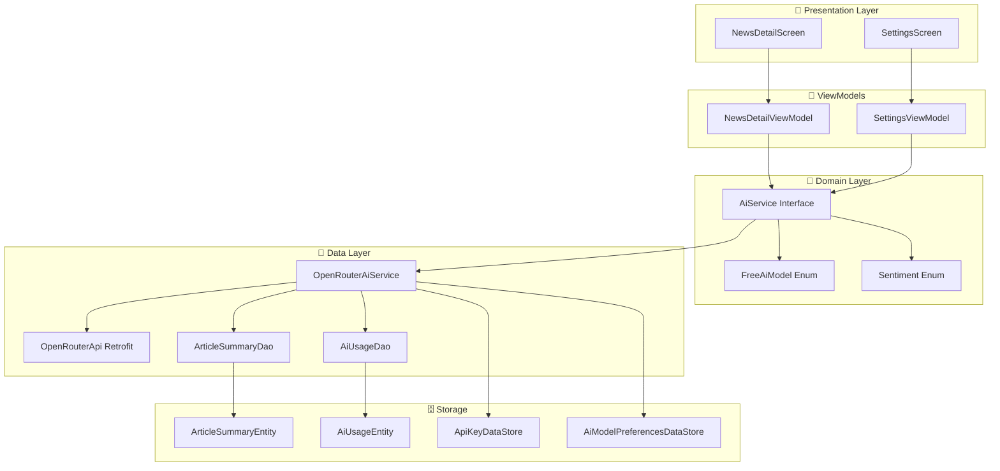
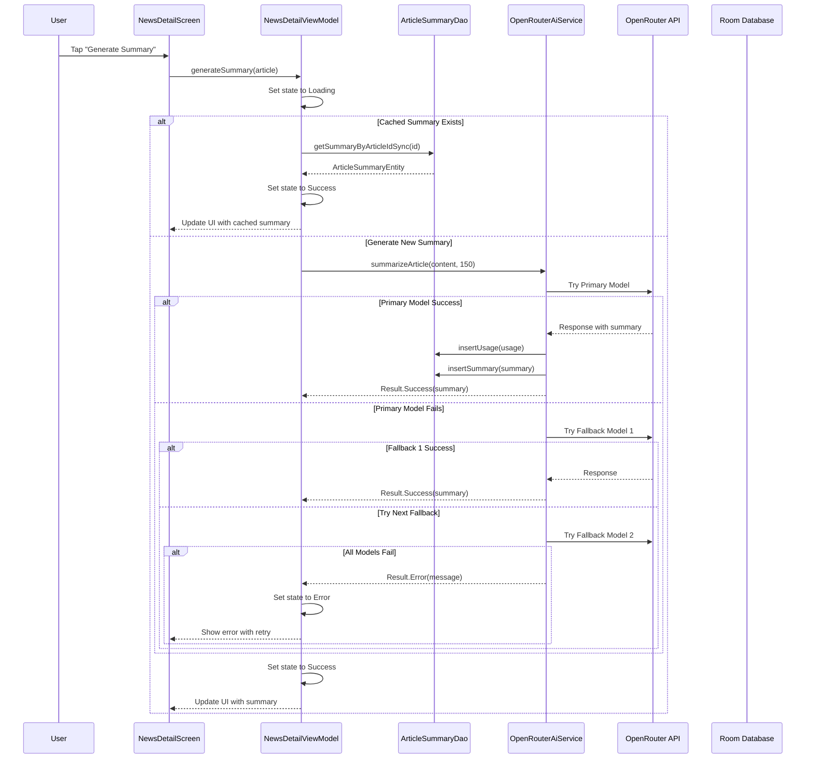
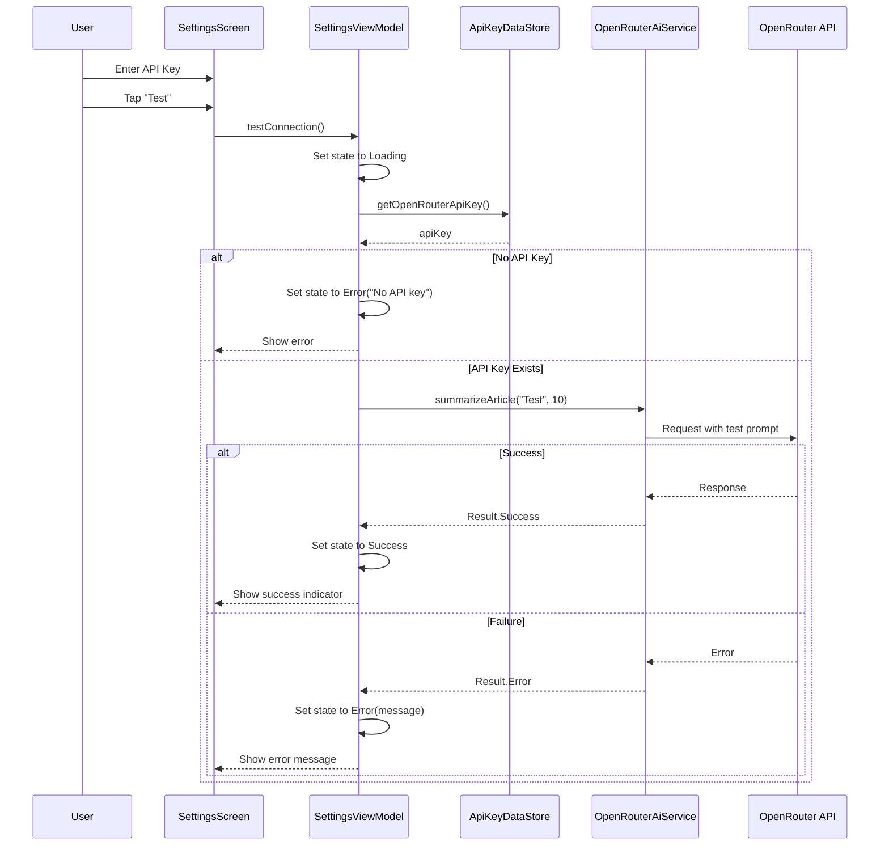

# OpenRouter AI Integration

This document describes the architecture and implementation of AI-powered features in NexusNews using the OpenRouter API.

## Overview

NexusNews integrates AI capabilities through **OpenRouter**, a unified API for accessing multiple Large Language Models (LLMs). The implementation focuses on:

- **Article Summarization**: Quick, concise summaries of news articles
- **Model Fallback**: Automatic fallback to alternative models for reliability
- **Usage Tracking**: Monitoring token consumption and API usage
- **Caching**: Storing AI responses to minimize API calls

## Architecture



## Components

### 1. Domain Layer

#### AiService Interface
```kotlin
interface AiService {
    suspend fun summarizeArticle(articleContent: String, maxLength: Int): Result<String>
    suspend fun analyzeSentiment(articleContent: String): Result<Sentiment>
    suspend fun translateArticle(articleContent: String, targetLanguage: String): Result<String>
}
```

**Location**: `app/src/main/java/com/example/nexusnews/domain/ai/AiService.kt`

**Responsibilities**:
- Defines contract for AI operations
- Abstracts AI provider implementation
- Enables testing with mock implementations

#### FreeAiModel Enum
```kotlin
enum class FreeAiModel(
    val id: String,
    val displayName: String,
    val description: String,
    val maxTokens: Int,
    val recommended: Boolean = false,
)
```

**Available Models**:
- **Llama 3.3 70B** (default): Meta's powerful multilingual model
- **Gemma 2 27B**: Google's efficient model with strong reasoning
- **Mistral Small 3.1**: Fast and efficient for quick tasks
- **Gemma 2 9B**: Lightweight and fast
- **Llama 3.1 8B**: Compact and efficient
- **Qwen 3 235B**: Large context window

**Location**: `app/src/main/java/com/example/nexusnews/domain/ai/FreeAiModel.kt`

### 2. Data Layer

#### OpenRouterAiService
**Location**: `app/src/main/java/com/example/nexusnews/data/ai/OpenRouterAiService.kt`

**Key Features**:

##### Model Fallback Logic
```kotlin
private val fallbackModels = listOf(
    FreeAiModel.LLAMA_3_3_70B,
    FreeAiModel.GEMMA_2_27B,
    FreeAiModel.MISTRAL_SMALL,
    FreeAiModel.GEMMA_2_9B,
    FreeAiModel.LLAMA_3_1_8B,
)

private suspend fun tryModelWithFallback(
    apiKey: String,
    model: FreeAiModel,
    prompt: String,
    maxTokens: Int,
    temperature: Float,
    requestType: AiRequestType,
    systemPrompt: String? = null,
): Result<String>
```

**Fallback Strategy**:
1. Try primary model (from user preference or default)
2. If that fails, try fallback models in order
3. If all models fail, return comprehensive error message

##### Usage Tracking
```kotlin
private suspend fun trackUsage(
    requestType: AiRequestType,
    modelUsed: String,
    promptTokens: Int,
    completionTokens: Int,
    totalTokens: Int,
)
```

**Tracked Metrics**:
- Request type (summarization, sentiment analysis, translation)
- Model used
- Prompt tokens, completion tokens, total tokens
- Timestamp

### 3. Database Layer

#### ArticleSummaryEntity
```kotlin
@Entity(tableName = "article_summaries")
data class ArticleSummaryEntity(
    val id: String,
    val articleId: String,  // Foreign key to ArticleEntity
    val summary: String,
    val modelUsed: String,
    val promptTokens: Int,
    val completionTokens: Int,
    val totalTokens: Int,
    val generatedAt: LocalDateTime,
    val language: String = "en",
)
```

**Location**: `app/src/main/java/com/example/nexusnews/data/local/entity/ArticleSummaryEntity.kt`

**Features**:
- Foreign key relationship with CASCADE delete
- Index on `article_id` for query optimization
- Stores model and token usage metadata

#### AiUsageEntity
```kotlin
@Entity(tableName = "ai_usage")
data class AiUsageEntity(
    val id: String,
    val requestType: AiRequestType,
    val modelUsed: String,
    val promptTokens: Int,
    val completionTokens: Int,
    val totalTokens: Int,
    val requestCount: Int,
    val timestamp: LocalDateTime,
)
```

**Location**: `app/src/main/java/com/example/nexusnews/data/local/entity/AiUsageEntity.kt`

**Request Types**:
- `SUMMARIZATION`
- `SENTIMENT_ANALYSIS`
- `TRANSLATION`
- `OTHER`

#### ArticleSummaryDao
```kotlin
@Dao
interface ArticleSummaryDao {
    @Query("SELECT * FROM article_summaries WHERE article_id = :articleId LIMIT 1")
    fun getSummaryByArticleId(articleId: String): Flow<ArticleSummaryEntity?>

    @Query("SELECT * FROM article_summaries WHERE article_id = :articleId LIMIT 1")
    suspend fun getSummaryByArticleIdSync(articleId: String): ArticleSummaryEntity?

    @Insert(onConflict = OnConflictStrategy.REPLACE)
    suspend fun insertSummary(summary: ArticleSummaryEntity)

    @Query("DELETE FROM article_summaries WHERE article_id = :articleId")
    suspend fun deleteSummariesByArticleId(articleId: String)

    @Query("DELETE FROM article_summaries WHERE generated_at < :threshold")
    suspend fun deleteOldSummaries(threshold: LocalDateTime)
}
```

**Location**: `app/src/main/java/com/example/nexusnews/data/local/dao/ArticleSummaryDao.kt`

#### AiUsageDao
```kotlin
@Dao
interface AiUsageDao {
    @Query("SELECT SUM(total_tokens) FROM ai_usage WHERE timestamp BETWEEN :startDate AND :endDate")
    suspend fun getTotalTokensByDateRange(startDate: LocalDateTime, endDate: LocalDateTime): Int?

    @Query("SELECT SUM(request_count) FROM ai_usage WHERE timestamp BETWEEN :startDate AND :endDate")
    suspend fun getTotalRequestsByDateRange(startDate: LocalDateTime, endDate: LocalDateTime): Int?

    @Query("SELECT * FROM ai_usage WHERE timestamp >= date('now', '-' || :days || ' days') ORDER BY timestamp DESC")
    fun getUsageForLastDays(days: Int): Flow<List<AiUsageEntity>>

    @Insert(onConflict = OnConflictStrategy.REPLACE)
    suspend fun insertUsage(usage: AiUsageEntity)
}
```

**Location**: `app/src/main/java/com/example/nexusnews/data/local/dao/AiUsageDao.kt`

### 4. Presentation Layer

#### NewsDetailViewModel
```kotlin
@HiltViewModel
class NewsDetailViewModel @Inject constructor(
    private val newsRepository: NewsRepository,
    private val aiService: AiService,
    private val articleSummaryDao: ArticleSummaryDao,
) : BaseViewModel() {
    private val _summaryState = MutableStateFlow<SummaryState>(SummaryState.Idle)
    val summaryState: StateFlow<SummaryState> = _summaryState.asStateFlow()

    fun generateSummary(article: Article) { /* ... */ }
    private suspend fun loadCachedSummary(articleId: String) { /* ... */ }
}
```

**Location**: `app/src/main/java/com/example/nexusnews/presentation/screens/NewsDetailViewModel.kt`

**Summary States**:
- `Idle`: No summary generated yet
- `Loading`: Summary generation in progress
- `Success`: Summary generated and cached
- `Error`: Summary generation failed

#### SettingsViewModel
```kotlin
@HiltViewModel
class SettingsViewModel @Inject constructor(
    private val themePreferences: ThemePreferencesDataStore,
    private val notificationPreferences: NotificationPreferencesDataStore,
    private val cacheManager: CacheManager,
    private val apiKeyDataStore: ApiKeyDataStore,
    private val aiModelPreferences: AiModelPreferencesDataStore,
    private val aiService: AiService,
) : ViewModel() {
    private val _connectionTestState = MutableStateFlow<ConnectionTestState>(ConnectionTestState.Idle)
    val connectionTestState: StateFlow<ConnectionTestState> = _connectionTestState

    fun testConnection() { /* ... */ }
    fun setApiKey(key: String) { /* ... */ }
    fun setDefaultAiModel(modelId: String) { /* ... */ }
}
```

**Location**: `app/src/main/java/com/example/nexusnews/presentation/screens/settings/SettingsViewModel.kt`

**Connection Test States**:
- `Idle`: No test performed
- `Loading`: Test in progress
- `Success`: API key is valid
- `Error`: API key is invalid or API is unavailable

#### UI Components

##### SummaryCard
```kotlin
@Composable
fun SummaryCard(
    summary: ArticleSummaryEntity,
    modifier: Modifier = Modifier,
) { /* ... */ }
```

**Location**: `app/src/main/java/com/example/nexusnews/ui/components/SummaryCard.kt`

**Features**:
- Displays summary text
- Shows model used and timestamp
- Displays token usage
- Uses primary container color for visual distinction

##### GenerateSummaryButton
```kotlin
@Composable
private fun GenerateSummaryButton(onClick: () -> Unit) { /* ... */ }
```

**Features**:
- Star icon for AI branding
- Disabled when offline
- Triggers summary generation

##### LoadingSummaryCard
```kotlin
@Composable
private fun LoadingSummaryCard() { /* ... */ }
```

**Features**:
- Circular progress indicator
- "Generating summary..." message

##### ErrorSummaryCard
```kotlin
@Composable
private fun ErrorSummaryCard(
    message: String,
    onRetry: () -> Unit,
) { /* ... */ }
```

**Features**:
- Error message display
- Retry button
- Error container color

## Data Flow

### Summarization Flow



### Connection Test Flow



## Configuration

### OpenRouter API

**Base URL**: `https://openrouter.ai/api/v1/`

**Headers**:
```
Authorization: Bearer <API_KEY>
Content-Type: application/json
HTTP-Referer: <APP_PACKAGE_NAME>
X-Title: <APP_NAME>
```

**Request Format**:
```json
{
  "model": "meta-llama/llama-3.3-70b-instruct:free",
  "messages": [
    {"role": "system", "content": "You are a news summarization assistant..."},
    {"role": "user", "content": "Summarize this article..."}
  ],
  "max_tokens": 200,
  "temperature": 0.3
}
```

**Response Format**:
```json
{
  "id": "gen-xxx",
  "model": "meta-llama/llama-3.3-70b-instruct:free",
  "choices": [
    {
      "message": {
        "role": "assistant",
        "content": "Summary text here..."
      }
    }
  ],
  "usage": {
    "prompt_tokens": 150,
    "completion_tokens": 50,
    "total_tokens": 200
  }
}
```

### Free Tier Limits

- **Requests**: 50 requests/day per model
- **Rate Limit**: 20 requests/minute
- **Cost**: Free (no charges)

### Prompt Engineering

#### Summarization Prompt
```
Summarize the following news article in approximately 150 characters.
Focus on the key facts and main points. Be concise and objective.
Do not include phrases like "This article discusses" or "The article is about".
Just provide the summary directly.

Article:
{content}
```

**Parameters**:
- `max_tokens`: 200 (150 + 50 buffer)
- `temperature`: 0.3 (low for consistency)

#### Sentiment Analysis Prompt
```
Analyze the sentiment of this news article.
Respond with only one word: POSITIVE, NEUTRAL, or NEGATIVE.

Article:
{content}
```

**Parameters**:
- `max_tokens`: 10
- `temperature`: 0.1 (very low for deterministic output)

#### Translation Prompt
```
Translate the following news article to {targetLanguage}.
Preserve the meaning and tone. Provide only the translation.

Article:
{content}
```

**Parameters**:
- `max_tokens`: content.length + 500
- `temperature`: 0.3

## Error Handling

### Error Types

1. **Network Errors**
   - No internet connection
   - Timeout
   - DNS resolution failure

2. **API Errors**
   - 401: Invalid API key
   - 429: Rate limit exceeded
   - 500: Server error

3. **Model Errors**
   - Model unavailable
   - Model overloaded
   - Invalid model ID

### Error Handling Strategy

```kotlin
try {
    val result = aiService.summarizeArticle(content, maxLength)
    when (result) {
        is Result.Success -> ShowSummary(result.data)
        is Result.Error -> ShowError(result.exception)
    }
} catch (e: Exception) {
    ShowError(e)
}
```

### Fallback Behavior

When a model fails, the service automatically tries the next model in the fallback chain:

```
Llama 3.3 70B → Gemma 2 27B → Mistral Small → Gemma 2 9B → Llama 3.1 8B → Error
```

Each failed attempt is logged with:
- Model name
- Error message
- Timestamp

## Performance Considerations

### Caching Strategy

1. **Summary Caching**
   - Check cache before API call
   - Store summaries immediately after generation
   - Use Flow for reactive updates
   - Cascade delete when article is removed

2. **Usage Tracking**
   - Track all API calls
   - Store in database for analytics
   - Query for rate limiting
   - Display statistics in Settings

### Optimization Tips

1. **Minimize API Calls**
   - Always check cache first
   - Use appropriate max_tokens
   - Batch operations when possible

2. **Model Selection**
   - Use smaller models for simple tasks
   - Use larger models for complex tasks
   - Respect rate limits

3. **Network Efficiency**
   - Reuse OkHttp client
   - Use connection pooling
   - Implement retry with exponential backoff

## Security

### API Key Storage

- **Location**: EncryptedSharedPreferences
- **Encryption**: AES256_GCM with MasterKey
- **Access**: Only through ApiKeyDataStore
- **Lifecycle**: Cleared on app uninstall

### Data Privacy

- No user data sent to AI beyond article content
- Summaries stored locally
- Usage data anonymized
- No personal information in prompts

## Testing

### Unit Tests

- `OpenRouterAiServiceTest`: Test fallback logic, error handling
- `ArticleSummaryDaoTest`: Test CRUD operations
- `AiUsageDaoTest`: Test tracking queries

### Integration Tests

- Test with actual OpenRouter API
- Test model fallback chain
- Test rate limiting behavior
- Test offline behavior

### UI Tests

- Test summary generation flow
- Test connection test flow
- Test model selection
- Test error states

## ✅ Completed Features (January 2026)

### Phase 4: Advanced AI Features - IMPLEMENTED

All Phase 4 AI features have been successfully integrated into the application with full UI support:

1. ✅ **Sentiment Analysis**: Display sentiment on articles (Positive/Neutral/Negative)
2. ✅ **Key Points Extraction**: Extract main points with importance scores
3. ✅ **Entity Recognition**: Identify people, places, organizations with confidence
4. ✅ **Topic Classification**: Auto-categorize articles with primary/secondary topics
5. ✅ **AI Chat Assistant**: Context-aware Q&A via chat interface (route: `chat`)
6. ✅ **Bias Detection**: Detect bias and credibility indicators
7. ✅ **Recommendations**: Personalized article suggestions (route: `recommendations`)

**UI Integration**:
- Context menu in article detail screen with individual options for each feature
- Loading indicators for each AI analysis
- "Deep AI Analysis" to run all analyses at once
- Color-coded icons for visual distinction
- Beautiful Material Design 3 components

**See Implementation Plan**: [implementation_plan.md](../../implementation_plan.md)

## Future Enhancements

### Potential Improvements

1. **Content Generation**: Social media posts, captions (backend only, needs UI)
2. **Translation**: Multi-language article translation (backend only, needs UI)

### Performance Improvements

1. **Streaming Responses**: Show partial results
2. **Parallel Requests**: Multiple models simultaneously (partially implemented)
3. **Smart Caching**: LRU cache with TTL
4. **Predictive Caching**: Pre-generate summaries

### User Experience

1. **Custom Prompts**: User-defined prompts
2. **Prompt Templates**: Pre-built prompts for different tasks
3. **Model Comparison**: A/B test different models
4. **Usage Analytics**: Detailed usage dashboard

## Related Documentation

- [Implementation Plan](../../implementation_plan.md) - Complete AI feature implementation
- [Project Roadmap](/project/roadmap.md) - Phase 3 & 4 AI Integration
- [Developer Report](/report/developer.md) - Technical implementation details
- [User Guide](/report/user.md) - How to use AI features
- [Data Management](/architecture/data-management.md) - Database architecture
- [Network Layer](/architecture/network-layer.md) - API client configuration

## External References

- [OpenRouter Documentation](https://openrouter.ai/docs)
- [Llama 3.3 Documentation](https://llama.meta.com/docs)
- [Gemma 2 Documentation](https://ai.google.dev/gemma)
- [Mistral Documentation](https://docs.mistral.ai)
