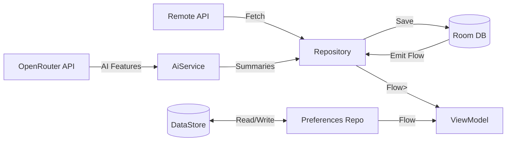

# Data Management

NexusNews employs an **offline-first** data strategy using a combination of Room Database for structured content and DataStore for user preferences.

## 💾 Local Storage Strategy

### Room Database (Structured Data)

Used for caching articles, bookmarks, and search history.

- **Database**: `AppDatabase` (Room)
- **Entities**:
  - `ArticleEntity`: Cached news articles (Offline reading support)
  - `BookmarkEntity`: User's saved articles and favorites
- **Relations**:
  - 1:1 relation between Articles and Bookmarks via `articleId`
- **Type Converters**:
  - `LocalDateTime` support
  - `List<String>` for tags

```kotlin
@Entity(tableName = "articles")
data class ArticleEntity(
    @PrimaryKey val id: String,
    val title: String,
    val content: String,
    val cachedAt: LocalDateTime
)
```

### DataStore (Preferences)

Used for lightweight user settings and flags.

**Theme & Accessibility:**
- **ThemePreferencesDataStore**:
  - `theme_mode`: LIGHT, DARK, or SYSTEM
- **AccessibilityPreferencesDataStore**:
  - `font_scale`: Float multiplier (0.8x - 2.0x)
  - `reduce_animations`: Boolean
  - `high_contrast`: Boolean

**Notifications & Privacy:**
- **NotificationPreferencesDataStore**:
  - `breaking_news_enabled`: Boolean
  - `daily_digest_enabled`: Boolean
  - `digest_time_hour`: Int (0-23)
  - `enabled_categories`: Set<NewsCategory>
  - `sound_enabled`, `vibration_enabled`: Boolean
- **PrivacyPreferencesDataStore**:
  - `analytics_enabled`: Boolean
  - `crash_reporting_enabled`: Boolean
  - `personalization_enabled`: Boolean

**Feed Customization:**
- **FeedPreferencesDataStore**:
  - `default_category`: NewsCategory
  - `articles_per_page`: Int
  - `auto_refresh_minutes`: Int
  - `show_images`: Boolean

**AI Settings:**
- **AiModelPreferencesDataStore**:
  - `default_model`: String (model ID)
  - `fallback_model`: String
  - `max_tokens_per_request`: Int
  - `temperature`: Double

**Secure Storage:**
- **ApiKeyDataStore** (EncryptedSharedPreferences):
  - `openrouter_api_key`: String (AES256_GCM encrypted)

**Why DataStore?**
- Asynchronous (Flow-based)
- Thread-safe
- Type-safe implementation
- No main-thread blocking (unlike SharedPreferences)

## 🔄 Repository Pattern

The repository layer mediates between data sources.

### NewsRepository

Handles fetching, caching, and bookmarking news.

`NewsRepositoryImpl`:
1. Check **Network** for fresh news
2. On success -> Save to **Room**
3. Emit data from **Room** (Single Source of Truth)
4. Handle bookmark/favorite toggles via `BookmarkDao`

### Data Flow



## 🤖 AI Integration

### OpenRouter API Client

NexusNews integrates with OpenRouter for AI-powered features:

- **API Client**: Retrofit-based `OpenRouterApi`
- **Models**: 6 free models (Llama 3.3 70B, Gemma 2 27B, Mistral Small, etc.)
- **Features**:
  - Article summarization
  - Sentiment analysis
  - Translation support
- **Security**: API keys stored in `ApiKeyDataStore` with AES256_GCM encryption
- **Rate Limits**: Free tier - 50 requests/day, 20 requests/minute

### AI Service Architecture

```kotlin
interface AiService {
    suspend fun summarizeArticle(content: String, maxLength: Int): Result<String>
    suspend fun analyzeSentiment(content: String): Result<Sentiment>
    suspend fun translateArticle(content: String, targetLang: String): Result<String>
}
```

Implementation: `OpenRouterAiService` with prompt engineering and error handling.

## 🔐 Security

- **API Keys**: Stored in `EncryptedSharedPreferences` with AES256_GCM encryption
- **Database**: Standard Room (Encryption can be added via SQLCipher)
- **Network**: HTTPS only for all API calls
