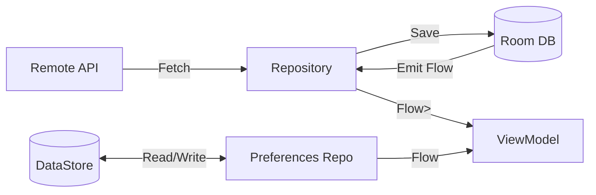

# Data Management

NexusNews employs an **offline-first** data strategy using a combination of Room Database for structured content and DataStore for user preferences.

## 💾 Local Storage Strategy

### Room Database (Structured Data)

Used for caching articles, bookmarks, and search history.

- **Database**: `AppDatabase` (Room)
- **Entities**:
  - `ArticleEntity`: Cached news articles (Offline reading support)
  - `BookmarkEntity`: User's saved articles and favorites
- **Relations**:
  - 1:1 relation between Articles and Bookmarks via `articleId`
- **Type Converters**:
  - `LocalDateTime` support
  - `List<String>` for tags

```kotlin
@Entity(tableName = "articles")
data class ArticleEntity(
    @PrimaryKey val id: String,
    val title: String,
    val content: String,
    val cachedAt: LocalDateTime
)
```

### DataStore (Preferences)

Used for lightweight user settings and flags.

- **ThemePreferencesDataStore**:
  - `theme_mode`: LIGHT, DARK, or SYSTEM
- **AccessibilityPreferencesDataStore**:
  - `font_scale`: Float multiplier (0.8x - 2.0x)
  - `reduce_animations`: Boolean
  - `high_contrast`: Boolean
- **SearchPreferencesDataStore**:
  - `search_history`: Recent query list

**Why DataStore?**
- Asynchronous (Flow-based)
- Thread-safe
- Type-safe implementation
- No main-thread blocking (unlike SharedPreferences)

## 🔄 Repository Pattern

The repository layer mediates between data sources.

### NewsRepository

Handles fetching, caching, and bookmarking news.

`NewsRepositoryImpl`:
1. Check **Network** for fresh news
2. On success -> Save to **Room**
3. Emit data from **Room** (Single Source of Truth)
4. Handle bookmark/favorite toggles via `BookmarkDao`

### Data Flow



## 🔐 Security

- **API Keys**: Stored in `EncryptedFile` or equivalent secure storage on supported devices.
- **Database**: Standard Room (Encryption can be added via SQLCipher).
