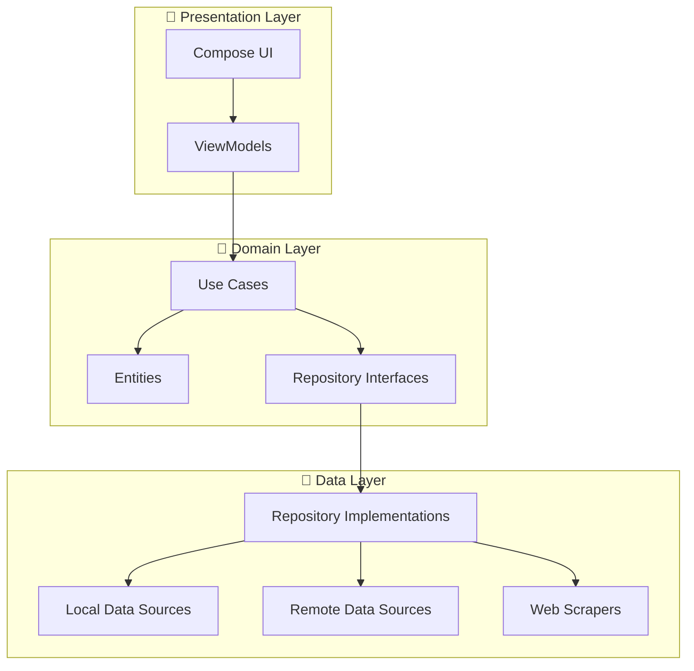
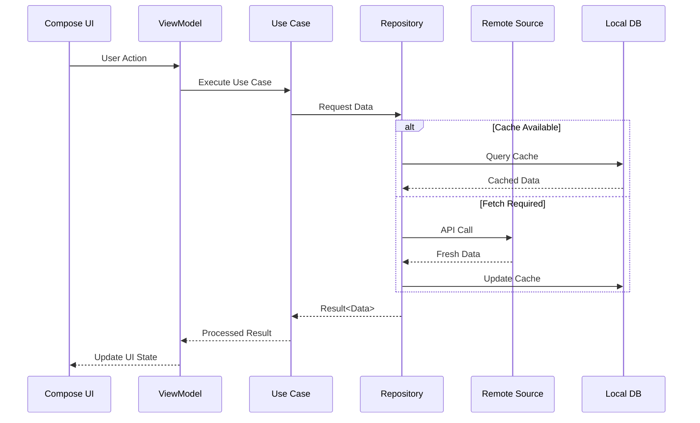

# Architecture Overview

NexusNews follows **Clean Architecture** principles with **MVVM** pattern, ensuring separation of concerns, testability, and maintainability.

## 🏛️ Architecture Layers



## 📐 Layer Responsibilities

### Presentation Layer
- **Location**: `app/src/main/java/com/example/nexusnews/presentation/`
- **Purpose**: UI components and state management
- **Components**:
  - Jetpack Compose screens
  - ViewModels (MVVM pattern)
  - UI State classes
  - Navigation logic

### Domain Layer
- **Location**: `app/src/main/java/com/example/nexusnews/domain/`
- **Purpose**: Business logic and entities
- **Components**:
  - Use Cases (single responsibility)
  - Domain Models (entities)
  - Repository Interfaces
  - Domain-specific exceptions

### Data Layer
- **Location**: `app/src/main/java/com/example/nexusnews/data/`
- **Purpose**: Data management and sources
- **Components**:
  - Repository Implementations
  - Local data sources (Room)
  - Remote data sources (Retrofit)
  - Web scrapers (Jsoup)
  - Data mappers

## 🔄 Data Flow



## 🎯 Design Patterns

### 1. **MVVM (Model-View-ViewModel)**
- **View**: Compose UI components
- **ViewModel**: State management with StateFlow
- **Model**: Domain entities and repositories

### 2. **Repository Pattern**
- Single source of truth
- Abstracts data sources
- Handles caching strategy

### 3. **Use Case Pattern**
- Single responsibility per use case
- Encapsulates business logic
- Reusable across ViewModels

### 4. **Adapter Pattern (News Sources)**
- Unified interface for different sources
- API-based sources (NewsAPI, Guardian)
- Scraper-based sources (HBVL, GvA)

### 5. **Strategy Pattern (AI Models)**
- Model selection based on task
- Cost optimization
- Fallback mechanisms

## 🗂️ Module Structure

```
app/
├── data/
│   ├── local/          # Room database, DAOs, entities
│   ├── remote/         # Retrofit services, DTOs
│   ├── scraper/        # Web scraping logic
│   ├── source/         # News source adapters
│   ├── ai/             # OpenRouter AI integration
│   └── repository/     # Repository implementations
│
├── domain/
│   ├── model/          # Domain entities
│   ├── repository/     # Repository interfaces
│   └── usecase/        # Business logic use cases
│
├── presentation/
│   ├── screen/         # Compose screens
│   ├── viewmodel/      # ViewModels
│   ├── component/      # Reusable UI components
│   └── navigation/     # Navigation logic
│
└── di/                 # Dependency injection modules
```

## 🔌 Dependency Injection

**Framework**: Hilt (Dagger)

**Modules**:
- `AppModule` - Application-level dependencies
- `DatabaseModule` - Room database
- `NetworkModule` - Retrofit, OkHttp
- `RepositoryModule` - Repository bindings
- `SourceModule` - News source adapters
- `AIModule` - OpenRouter AI client

## 📚 Related Documentation

- [Multi-Source News Architecture](/architecture/news-sources)
- [OpenRouter AI Integration](/architecture/ai-integration)
- [Data Management](/architecture/data-management)
- [Dependency Injection](/architecture/dependency-injection)

## 🔗 External References

- [Android Architecture Guide](https://developer.android.com/topic/architecture)
- [Clean Architecture by Uncle Bob](https://blog.cleancoder.com/uncle-bob/2012/08/13/the-clean-architecture.html)
- [MVVM Pattern](https://developer.android.com/topic/libraries/architecture/viewmodel)
