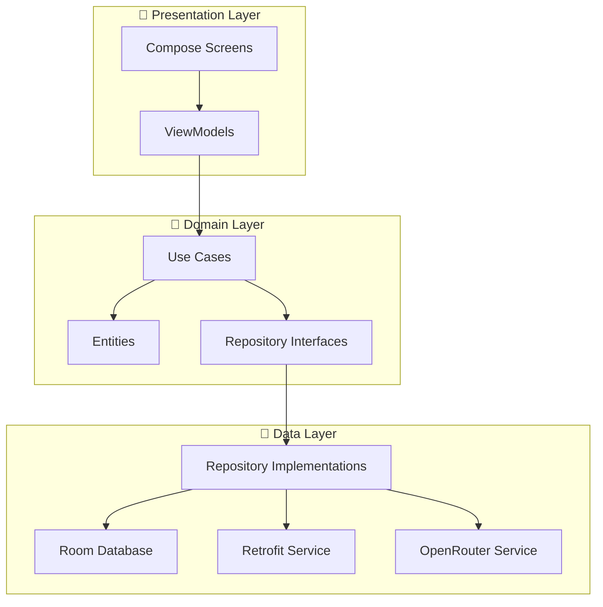
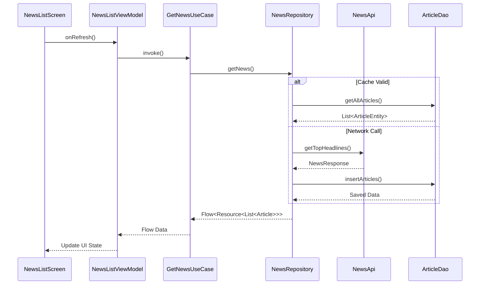

# Architecture Overview

NexusNews follows **Clean Architecture** principles with **MVVM** pattern, ensuring separation of concerns, testability, and maintainability.

## 🏛️ Architecture Layers



## 📐 Layer Responsibilities

### Presentation Layer

- **Location**: `com.example.nexusnews.presentation`
- **Purpose**: UI components and state management
- **Components**:
  - **Screens**: `NewsListScreen`, `NewsDetailScreen`
  - **ViewModels**: `NewsListViewModel`, `NewsDetailViewModel` (Co-located with (screens)
  - **Navigation**: `NavGraph`, `Route`
  - **Theme**: Material 3 implementation

### Domain Layer

- **Location**: `com.example.nexusnews.domain`
- **Purpose**: Pure business logic and entities (Android-free)
- **Components**:
  - **Use Cases**: `SummarizeArticleUseCase`, `AnalyzeSentimentUseCase`
  - **Models**: `Article`, `NewsSource`, `AiSummary`
  - **Repository Interfaces**: `NewsRepository`, `SettingsRepository`

### Data Layer

- **Location**: `com.example.nexusnews.data`
- **Purpose**: Data retrieval, caching, and storage
- **Components**:
  - **Repositories**: `NewsRepositoryImpl` (Single Source of Truth)
  - **Local**: `ArticleDao`, `NexusNewsDatabase` (Room)
  - **Remote**: `NewsApiService` (Retrofit)
  - **AI**: `OpenRouterAiService` (Custom Service)
  - **DI**: `RepositoryModule`

## 🔄 Data Flow



## 🎯 Design Patterns

### 1. **MVVM (Model-View-ViewModel)**

- **View**: `NewsListScreen.kt` (Compose)
- **ViewModel**: `NewsListViewModel.kt` (StateFlow)
- **Model**: `Article.kt` (Domain Entity)

### 2. **Repository Pattern**
`NewsRepositoryImpl` mediates between `NewsApiService` and `ArticleDao`, employing a "Network-First" or "Cache-First" strategy depending on connectivity.

### 3. **Use Case Pattern**
Business logic is encapsulated in small, reusable classes:
- `SummarizeArticleUseCase` provided by `AiModule`
- `ExtractKeyPointsUseCase`
- `ChatWithAssistantUseCase`

### 4. **Dependency Injection (Hilt)**
Dependencies are provided via modules:
- `NetworkModule`: Provides `OkHttpClient`, `Retrofit`
- `DatabaseModule`: Provides `RoomDatabase`, `Dao`s
- `RepositoryModule` (in `data/di`): Binds `NewsRepositoryImpl` to `NewsRepository`
- `AiModule`: Provides `OpenRouterAiService`

## 🗂️ Module Structure

```
app/src/main/java/com/example/nexusnews/
├── data/
│   ├── di/             # RepositoryModule
│   ├── local/          # Room (ArticleDao, Database)
│   ├── remote/         # Retrofit (NewsApiService)
│   ├── repository/     # NewsRepositoryImpl
│   └── source/         # Data Sources
│
├── domain/
│   ├── model/          # Article, Source (Entities)
│   ├── repository/     # NewsRepository (Interface)
│   └── usecase/        # SummarizeArticleUseCase, etc.
│       └── ai/         # Specialized AI Use Cases
│
├── di/                 # Core Modules (Network, Database, AI)
│
├── presentation/
│   ├── navigation/     # NavHost, Routes
│   ├── screens/        # Feature Screens
│   │   ├── NewsListScreen.kt
│   │   └── NewsListViewModel.kt
│   └── theme/          # Type, Color, Theme
│
└── NexusNewsApplication.kt
```

## 🔌 Dependency Injection Overview

| Module | Location | Provides |
|:-------|:---------|:---------|
| **NetworkModule** | `di/NetworkModule.kt` | `OkHttpClient`, `Retrofit`, `Moshi` |
| **DatabaseModule** | `di/DatabaseModule.kt` | `NexusNewsDatabase`, `ArticleDao`, `BookmarksDao` |
| **AiModule** | `di/AiModule.kt` | `OpenRouterAiService` |
| **CacheModule** | `di/CacheModule.kt` | `CacheManager` |
| **RepositoryModule** | `data/di/RepositoryModule.kt` | `NewsRepository`, `SettingsRepository` |

## 📚 Related Documentation

- [OpenRouter AI Integration](/architecture/ai-integration)
- [Data Management](/architecture/data-management)
- [Project Overview](/project/overview)

## 🔗 External References

- [Google Guide to App Architecture](https://developer.android.com/topic/architecture)
- [Hilt Dependency Injection](https://developer.android.com/training/dependency-injection/hilt-android)
