title: Developer Technical Compendium
description: The complete architectural blueprint for NexusNews - every class, data flow, and design decision documented with code references and diagrams.
category: report
lastUpdated: 2026-01-16
aiContext: true
mermaid: true
tags: [developer-guide, architecture, mermaid, di, room, retrofit, hilt, forensic]

# Developer Technical Compendium

> [!IMPORTANT]
> This document is the **technical bible** for NexusNews `v1.0.0`. All constants, patterns, and logic flows have been **forensically verified** against the source code. Code snippets are direct extracts, not approximations.

## 01. Architecture Overview

NexusNews follows a **Clean Architecture** pattern combined with **MVVM** for the presentation layer. This design ensures:

- **Separation of Concerns**: Each layer has a specific responsibility
- **Testability**: Business logic is isolated from Android framework dependencies
- **Maintainability**: Changes in one layer don't cascade to others
- **Dependency Rule**: Inner layers don't know about outer layers

### 1.1 High-Level Architecture Diagram

```mermaid
flowchart TB
    subgraph PRESENTATION["📱 Presentation Layer"]
        direction TB
        UI["Composables<br/>NewsListScreen, NewsDetailScreen"]
        VM["ViewModels<br/>NewsListViewModel, NewsDetailViewModel"]
        STATE["UiState<br/>Idle, Loading, Success, Error"]
    end

    subgraph DOMAIN["🧠 Domain Layer"]
        direction TB
        UC["UseCases<br/>SummarizeArticleUseCase, etc."]
        REPO_INT["Repository Interfaces<br/>NewsRepository, AiService"]
        MODEL["Domain Models<br/>Article, SearchQuery"]
    end

    subgraph DATA["💾 Data Layer"]
        direction TB
        REPO_IMPL["Repository Implementations<br/>NewsRepositoryImpl"]
        LOCAL["Local DataSources<br/>ArticleDao, BookmarkDao"]
        REMOTE["Remote DataSources<br/>NewsApiService, OpenRouterApi"]
        MAPPER["Mappers<br/>ArticleMapper, EntityMappers"]
    end

    subgraph INFRASTRUCTURE["⚙️ Infrastructure"]
        direction TB
        DI["Hilt Modules<br/>NetworkModule, DatabaseModule"]
        INTERCEPTOR["Interceptors<br/>AuthInterceptor, RetryInterceptor"]
        DB["Room Database<br/>AppDatabase"]
    end

    UI --> VM
    VM --> STATE
    VM --> UC
    UC --> REPO_INT
    REPO_INT -.->|"implements"| REPO_IMPL
    REPO_IMPL --> LOCAL
    REPO_IMPL --> REMOTE
    REPO_IMPL --> MAPPER
    LOCAL --> DB
    REMOTE --> INTERCEPTOR
    DI -.->|"provides"| REPO_IMPL
    DI -.->|"provides"| DB
```



### 1.2 Layer Responsibilities

| Layer | Responsibility | Android Dependencies | Key Files |
|:------|:---------------|:--------------------|:----------|
| **Presentation** | UI rendering, user input handling, state management | Compose, Hilt, Lifecycle | `NewsListScreen.kt`, `NewsDetailScreen.kt`, `*ViewModel.kt` |
| **Domain** | Business logic, use cases, entity definitions | None (Pure Kotlin) | `AiService.kt`, `Article.kt`, `*UseCase.kt` |
| **Data** | Data persistence, network calls, data mapping | Room, Retrofit, DataStore | `NewsRepositoryImpl.kt`, `OpenRouterAiService.kt`, `ArticleDao.kt` |
| **Infrastructure** | DI configuration, database setup, network config | Hilt, OkHttp, Room | `NetworkModule.kt`, `DatabaseModule.kt`, `AiModule.kt` |

### 1.3 Why Clean Architecture?

The architecture choice is driven by several factors:

1. **Android-Independent Domain**: The `domain/` package contains pure Kotlin with zero Android imports. This means use cases like `SummarizeArticleUseCase` can be unit-tested without Robolectric or instrumented tests.

2. **Swappable Data Sources**: The repository pattern allows swapping `NewsApiService` for a different news provider without touching any UI code.

3. **Hilt Integration**: Dependency injection via Hilt modules (`@InstallIn(SingletonComponent::class)`) ensures all dependencies are wired at compile time with no runtime reflection.


## 02. Package Structure

The codebase is organized by **layer** within `com.example.nexusnews`. This organization makes it immediately clear where any given class belongs.

### 2.1 Complete Package Breakdown

```
com.example.nexusnews/
├── data/                          # Data Layer
│   ├── ai/                        # AI Service Implementation
│   │   ├── parser/                # Response Parsers (Moshi-based)
│   │   │   └── AiResponseParser.kt
│   │   ├── prompt/                # Prompt Builders for each AI feature
│   │   │   ├── AiPromptBuilder.kt
│   │   │   ├── BiasDetectionPromptBuilder.kt
│   │   │   ├── ChatPromptBuilder.kt
│   │   │   ├── ContentGenerationPromptBuilder.kt
│   │   │   ├── EntityRecognitionPromptBuilder.kt
│   │   │   ├── KeyPointsPromptBuilder.kt
│   │   │   ├── RecommendationsPromptBuilder.kt
│   │   │   └── TopicClassificationPromptBuilder.kt
│   │   ├── AiServiceConfig.kt     # Model configuration & fallback chain
│   │   └── OpenRouterAiService.kt # Main AI service implementation
│   ├── cache/                     # Cache Management
│   │   ├── CacheManager.kt        # Interface
│   │   └── CacheManagerImpl.kt    # Implementation with size tracking
│   ├── di/                        # Data-layer DI
│   │   └── RepositoryModule.kt    # Repository bindings
│   ├── local/                     # Local Data Sources
│   │   ├── dao/                   # Room DAOs
│   │   │   ├── AiUsageDao.kt
│   │   │   ├── ArticleDao.kt
│   │   │   ├── ArticleSummaryDao.kt
│   │   │   └── BookmarkDao.kt
│   │   ├── database/              # AppDatabase
│   │   │   ├── AppDatabase.kt
│   │   │   └── Converters.kt      # Room type converters
│   │   ├── datastore/             # DataStore preferences
│   │   │   ├── AccessibilityPreferencesDataStore.kt
│   │   │   ├── AiFeaturePreferencesDataStore.kt
│   │   │   ├── AiModelPreferencesDataStore.kt
│   │   │   ├── ApiKeyDataStore.kt
│   │   │   ├── CategoryPreferencesDataStore.kt
│   │   │   ├── FeedPreferencesDataStore.kt
│   │   │   ├── NotificationPreferencesDataStore.kt
│   │   │   ├── PrivacyPreferencesDataStore.kt
│   │   │   ├── SearchHistoryDataStore.kt
│   │   │   └── ThemePreferencesDataStore.kt
│   │   ├── entity/                # Room Entities
│   │   │   ├── AiUsageEntity.kt
│   │   │   ├── ArticleEntity.kt
│   │   │   ├── ArticleSummaryEntity.kt
│   │   │   └── BookmarkEntity.kt
│   │   └── LocalDataSource.kt     # Abstraction over local storage
│   ├── mapper/                    # Entity/Domain mappers
│   │   ├── ArticleMapper.kt
│   │   └── EntityMappers.kt
│   ├── remote/                    # Network Layer
│   │   ├── api/                   # Retrofit interfaces
│   │   │   ├── NewsApiService.kt  # NewsAPI.org interface
│   │   │   └── OpenRouterApi.kt   # OpenRouter AI interface
│   │   ├── dto/                   # Data Transfer Objects
│   │   │   ├── ApiResponse.kt
│   │   │   └── ErrorResponse.kt
│   │   ├── interceptor/           # OkHttp interceptors
│   │   │   ├── AuthInterceptor.kt
│   │   │   ├── ErrorInterceptor.kt
│   │   │   └── RetryInterceptor.kt
│   │   ├── model/                 # API response models
│   │   │   └── OpenRouterModels.kt
│   │   ├── NetworkDataSource.kt
│   │   ├── NewsRemoteDataSource.kt
│   │   └── RemoteDataSource.kt
│   ├── repository/                # Repository implementations
│   │   ├── BaseRepository.kt
│   │   └── NewsRepositoryImpl.kt
│   └── util/                      # Data utilities
│       ├── NetworkMonitor.kt      # Connectivity observer
│       └── RetryPolicy.kt         # Retry configuration
│
├── di/                            # Dependency Injection
│   ├── AiModule.kt                # AI service bindings
│   ├── CacheModule.kt             # Cache bindings
│   ├── DatabaseModule.kt          # Room bindings
│   └── NetworkModule.kt           # Retrofit/OkHttp bindings
│
├── domain/                        # Domain Layer (Pure Kotlin)
│   ├── ai/                        # AI abstractions
│   │   ├── AiService.kt           # AI service interface
│   │   ├── AnalysisModels.kt      # Result models for AI features
│   │   └── FreeAiModel.kt         # Model enum with specs
│   ├── model/                     # Domain entities
│   │   ├── Article.kt
│   │   └── SearchQuery.kt
│   ├── repository/                # Repository interfaces
│   │   └── NewsRepository.kt
│   └── usecase/                   # Business logic
│       ├── ai/                    # 10 AI use cases
│       │   ├── AnalyzeSentimentUseCase.kt
│       │   ├── ChatWithAssistantUseCase.kt
│       │   ├── ClassifyTopicUseCase.kt
│       │   ├── DetectBiasUseCase.kt
│       │   ├── ExtractKeyPointsUseCase.kt
│       │   ├── GenerateContentUseCase.kt
│       │   ├── GenerateRecommendationsUseCase.kt
│       │   ├── RecognizeEntitiesUseCase.kt
│       │   ├── SummarizeArticleUseCase.kt
│       │   └── TranslateArticleUseCase.kt
│       └── BaseUseCase.kt
│
├── presentation/                  # Presentation Layer
│   ├── common/                    # Shared components
│   │   ├── BaseViewModel.kt       # ViewModel base class
│   │   └── UiState.kt             # State sealed class
│   ├── navigation/                # Navigation setup
│   │   ├── NavGraph.kt            # Route definitions
│   │   ├── MainScreen.kt          # Scaffold with nav
│   │   ├── NavigationExtensions.kt
│   │   └── Screen.kt              # Route enum
│   ├── screens/                   # Feature screens
│   │   ├── bookmarks/
│   │   │   ├── BookmarksScreen.kt
│   │   │   └── BookmarksViewModel.kt
│   │   ├── chat/
│   │   │   └── ChatAssistantScreen.kt
│   │   ├── recommendations/
│   │   │   └── RecommendationsScreen.kt
│   │   ├── search/
│   │   │   ├── SearchScreen.kt
│   │   │   └── SearchViewModel.kt
│   │   ├── settings/
│   │   │   ├── SettingsScreen.kt
│   │   │   └── SettingsViewModel.kt
│   │   ├── NewsDetailScreen.kt
│   │   ├── NewsDetailViewModel.kt
│   │   ├── NewsListScreen.kt
│   │   └── NewsListViewModel.kt
│   └── theme/                     # Theme configuration
│       └── ThemeViewModel.kt
│
├── ui/                            # UI Components
│   ├── accessibility/             # A11y utilities
│   │   └── AccessibilityUtils.kt
│   ├── animations/                # Animation specs
│   │   └── Animations.kt
│   ├── components/                # Reusable composables
│   │   ├── ArticleAnalysisComponents.kt
│   │   ├── ArticleItem.kt
│   │   ├── SummaryCard.kt
│   │   ├── SwipeableArticleItem.kt
│   │   └── TagChip.kt
│   └── theme/                     # Color, Type, Theme
│       ├── Color.kt
│       ├── Theme.kt
│       └── Type.kt
│
├── util/                          # Utilities
│   ├── constants/                 # App constants
│   │   ├── ApiConstants.kt
│   │   ├── AppConstants.kt
│   │   ├── DatabaseConstants.kt
│   │   ├── NetworkConstants.kt
│   │   └── UiConstants.kt
│   ├── ErrorHandler.kt
│   ├── Extensions.kt
│   └── Result.kt
│
├── MainActivity.kt                # Entry point
└── NexusNewsApplication.kt        # Application class (@HiltAndroidApp)
```

## 03. Navigation Architecture

Navigation in NexusNews uses Jetpack Compose Navigation with type-safe route definitions.

### 3.1 Route Definitions

The app defines five main routes in `Screen.kt`:

<details>
<summary>📄 Screen.kt - Route Definitions</summary>

```kotlin
sealed class Screen(val route: String) {
    object Home : Screen("home")
    object Search : Screen("search")
    object Bookmarks : Screen("bookmarks")
    object Settings : Screen("settings")
    object ArticleDetail : Screen("article/{articleId}") {
        fun createRoute(articleId: String) = "article/$articleId"
    }
}
```

</details>

### 3.2 Navigation Graph

The `NavGraph.kt` file wires all routes together with their corresponding screens:

<details>
<summary>📄 NavGraph.kt - Navigation Graph Implementation</summary>

```kotlin
@Composable
fun NexusNewsNavGraph(
    navController: NavHostController,
    modifier: Modifier = Modifier,
    startDestination: String = Screen.Home.route,
) {
    NavHost(
        navController = navController,
        startDestination = startDestination,
        modifier = modifier,
    ) {
        composable(Screen.Home.route) {
            NewsListScreen(
                onArticleClick = { articleId ->
                    navController.navigate(Screen.ArticleDetail.createRoute(articleId))
                },
            )
        }

        composable(
            route = Screen.ArticleDetail.route,
            arguments = listOf(
                navArgument("articleId") { type = NavType.StringType },
            ),
        ) { backStackEntry ->
            val articleId = backStackEntry.arguments?.getString("articleId")
            check(articleId != null) { "articleId is required" }

            NewsDetailScreen(
                articleId = articleId,
                onBackClick = { navController.popBackStack() },
            )
        }
        // ... other routes (Search, Bookmarks, Settings)
    }
}
```

</details>

### 3.3 Navigation Flow Diagram

```mermaid
flowchart TD
    HOME["🏠 Home<br/>NewsListScreen"]
    SEARCH["🔍 Search<br/>SearchScreen"]
    BOOKMARKS["🔖 Bookmarks<br/>BookmarksScreen"]
    SETTINGS["⚙️ Settings<br/>SettingsScreen"]
    DETAIL["📄 Article Detail<br/>NewsDetailScreen"]

    HOME <-->|"Bottom Nav"| SEARCH
    HOME <-->|"Bottom Nav"| BOOKMARKS
    HOME <-->|"Bottom Nav"| SETTINGS

    HOME -->|"Tap article"| DETAIL
    SEARCH -->|"Tap result"| DETAIL
    BOOKMARKS -->|"Tap bookmark"| DETAIL

    DETAIL -->|"Back"| HOME
```



### 3.4 Route Table

| Route | Pattern | Arguments | Screen |
|:------|:--------|:----------|:-------|
| Home | `home` | None | `NewsListScreen` |
| Search | `search` | None | `SearchScreen` |
| Bookmarks | `bookmarks` | None | `BookmarksScreen` |
| Settings | `settings` | None | `SettingsScreen` |
| Article Detail | `article/{articleId}` | `articleId: String` | `NewsDetailScreen` |


## 04. State Management

NexusNews uses a unidirectional data flow pattern with Kotlin StateFlow for reactive state management.

### 4.1 UiState Sealed Class

The `UiState` sealed class represents all possible states for any data-loading operation:

<details>
<summary>📄 UiState.kt - State Representation</summary>

```kotlin
sealed class UiState<out T> {
    object Idle : UiState<Nothing>()
    object Loading : UiState<Nothing>()
    data class Success<T>(val data: T) : UiState<T>()
    data class Error(
        val message: String,
        val throwable: Throwable? = null
    ) : UiState<Nothing>()

    fun isLoading(): Boolean = this is Loading
}
```

</details>

**State Descriptions:**

| State | When It Occurs | UI Representation |
|:------|:---------------|:------------------|
| **Idle** | Initial state before any action | Welcome message or placeholder |
| **Loading** | Data is being fetched | Progress indicator |
| **Success** | Data received successfully | Content displayed |
| **Error** | Operation failed | Error message + retry button |

### 4.2 BaseViewModel Pattern

All ViewModels extend `BaseViewModel`, which provides:

- Thread-safe state updates via `updateState()`
- Exception handling via `CoroutineExceptionHandler`
- StateFlow exposure for Compose collection

<details>
<summary>📄 BaseViewModel.kt - ViewModel Base Class</summary>

```kotlin
abstract class BaseViewModel<S : Any>(initialState: S) : ViewModel() {
    private val _state = MutableStateFlow(initialState)
    val state: StateFlow<S> = _state.asStateFlow()

    protected val currentState: S get() = _state.value

    protected fun updateState(reducer: (S) -> S) {
        _state.update(reducer)
    }

    protected val exceptionHandler = CoroutineExceptionHandler { _, throwable ->
        Timber.e(throwable, "Unhandled exception in ViewModel")
    }
}
```

</details>

### 4.3 ViewModel to UI Data Flow


### 4.4 State Collection in Composables

<details>
<summary>📄 NewsListScreen.kt - State Collection Pattern</summary>

```kotlin
@Composable
fun NewsListScreen(
    viewModel: NewsListViewModel = hiltViewModel(),
    onArticleClick: (String) -> Unit,
) {
    val state by viewModel.state.collectAsStateWithLifecycle()

    when (val uiState = state.articlesState) {
        is UiState.Idle -> IdleContent()
        is UiState.Loading -> LoadingIndicator()
        is UiState.Success -> ArticleList(
            articles = uiState.data,
            onArticleClick = onArticleClick
        )
        is UiState.Error -> ErrorContent(
            message = uiState.message,
            onRetry = { viewModel.retryLoadNews() }
        )
    }
}
```

</details>


## 05. Data Layer Deep Dive

### 5.1 Repository Pattern

The `NewsRepositoryImpl` orchestrates data from multiple sources and implements the **Network-First, Cache-Second** strategy:

<details>
<summary>📄 NewsRepositoryImpl.kt - Repository Implementation</summary>

```kotlin
@Singleton
class NewsRepositoryImpl @Inject constructor(
    private val remoteDataSource: NewsRemoteDataSource,
    private val articleDao: ArticleDao,
    private val bookmarkDao: BookmarkDao,
) : NewsRepository {

    override fun getArticles(forceRefresh: Boolean): Flow<Result<List<Article>>> = flow {
        emit(Result.Loading)
        try {
            // Network-first: Always fetch fresh data
            val articles = remoteDataSource.getTopHeadlines(
                country = "us",
                pageSize = 20,
            )
            // Cache for offline access
            articleDao.insertArticles(articles.toEntityList())
            emit(Result.Success(articles))
        } catch (e: Exception) {
            emit(Result.Error(e))
        }
    }

    override fun getArticleById(id: String): Flow<Result<Article>> = flow {
        emit(Result.Loading)
        try {
            // Cache-first: Read from local database
            val articleEntity = articleDao.getArticleById(id)
            if (articleEntity != null) {
                emit(Result.Success(articleEntity.toDomain()))
            } else {
                emit(Result.Error(Exception("Article not found")))
            }
        } catch (e: Exception) {
            emit(Result.Error(e))
        }
    }
}
```

</details>

### 5.2 Data Source Strategy

The repository uses different strategies depending on the operation:


| Operation | Strategy | Rationale |
|:----------|:---------|:----------|
| `getArticles()` | Network-first | News headlines must be fresh |
| `getArticleById()` | Cache-first | Article content doesn't change |
| `getSummary()` | Cache-forever | AI output is deterministic |
| `getBookmarks()` | Local-only | User data never leaves device |

### 5.2 Full Content Scraping

To overcome the limitations of NewsAPI (which often returns truncated content), NexusNews implements a smart scraping service.

**Component**: `ArticleScraperService.kt`
**Library**: Jsoup

**Logic Flow:**
1. Repository detects truncated content (e.g., ends in `[+1234 chars]`)
2. `ArticleScraperService` fetches the original URL
3. Parses the HTML to extract the main article body
4. Updates the local `Article` entity in the Room database
5. UI updates automatically via `Flow` observation

This ensures users get the complete reading experience without leaving the app.


## 06. Database Schema

### 6.1 Entity-Relationship Diagram


### 6.2 Entity Definitions

#### ArticleEntity

<details>
<summary>📄 ArticleEntity.kt - Article Database Entity</summary>

```kotlin
@Entity(tableName = DatabaseConstants.ARTICLES_TABLE)
data class ArticleEntity(
    @PrimaryKey
    @ColumnInfo(name = DatabaseConstants.COLUMN_ID)
    val id: String,
    @ColumnInfo(name = DatabaseConstants.COLUMN_TITLE)
    val title: String,
    @ColumnInfo(name = DatabaseConstants.COLUMN_DESCRIPTION)
    val description: String?,
    @ColumnInfo(name = DatabaseConstants.COLUMN_CONTENT)
    val content: String?,
    @ColumnInfo(name = DatabaseConstants.COLUMN_URL)
    val url: String,
    @ColumnInfo(name = DatabaseConstants.COLUMN_IMAGE_URL)
    val imageUrl: String?,
    @ColumnInfo(name = DatabaseConstants.COLUMN_AUTHOR)
    val author: String?,
    @ColumnInfo(name = DatabaseConstants.COLUMN_SOURCE)
    val source: String,
    @ColumnInfo(name = DatabaseConstants.COLUMN_PUBLISHED_AT)
    val publishedAt: LocalDateTime,
    @ColumnInfo(name = DatabaseConstants.COLUMN_CATEGORY)
    val category: String?,
    @ColumnInfo(name = "tags")
    val tags: List<String> = emptyList(),
    @ColumnInfo(name = "cached_at")
    val cachedAt: LocalDateTime = LocalDateTime.now(),
)
```

</details>

#### AiUsageEntity

<details>
<summary>📄 AiUsageEntity.kt - AI Usage Tracking Entity</summary>

```kotlin
@Entity(tableName = DatabaseConstants.AI_USAGE_TABLE)
data class AiUsageEntity(
    @PrimaryKey
    @ColumnInfo(name = DatabaseConstants.COLUMN_ID)
    val id: String,
    @ColumnInfo(name = DatabaseConstants.COLUMN_REQUEST_TYPE)
    val requestType: AiRequestType,
    @ColumnInfo(name = DatabaseConstants.COLUMN_MODEL_USED)
    val modelUsed: String,
    @ColumnInfo(name = DatabaseConstants.COLUMN_PROMPT_TOKENS)
    val promptTokens: Int,
    @ColumnInfo(name = DatabaseConstants.COLUMN_COMPLETION_TOKENS)
    val completionTokens: Int,
    @ColumnInfo(name = DatabaseConstants.COLUMN_TOTAL_TOKENS)
    val totalTokens: Int,
    @ColumnInfo(name = DatabaseConstants.COLUMN_REQUEST_COUNT)
    val requestCount: Int,
    @ColumnInfo(name = DatabaseConstants.COLUMN_LATENCY_MS)
    val latencyMs: Long,
    @ColumnInfo(name = DatabaseConstants.COLUMN_GENERATED_AT)
    val timestamp: LocalDateTime,
)
```

</details>

### 6.3 Database Constants

<details>
<summary>📄 DatabaseConstants.kt - Table and Column Names</summary>

```kotlin
object DatabaseConstants {
    const val DATABASE_NAME = "nexus_news.db"
    const val DATABASE_VERSION = 2

    // Table names
    const val ARTICLES_TABLE = "articles"
    const val BOOKMARKS_TABLE = "bookmarks"
    const val ARTICLE_SUMMARIES_TABLE = "article_summaries"
    const val AI_USAGE_TABLE = "ai_usage"

    // Column names
    const val COLUMN_ID = "id"
    const val COLUMN_TITLE = "title"
    const val COLUMN_DESCRIPTION = "description"
    const val COLUMN_CONTENT = "content"
    const val COLUMN_URL = "url"
    const val COLUMN_IMAGE_URL = "image_url"
    const val COLUMN_AUTHOR = "author"
    const val COLUMN_SOURCE = "source"
    const val COLUMN_PUBLISHED_AT = "published_at"
    const val COLUMN_CATEGORY = "category"
    // ... additional columns
}
```

</details>


## 07. Network Layer

### 7.1 Retrofit Configuration

The app uses two separate Retrofit instances for different APIs:

<details>
<summary>📄 NetworkModule.kt - Network Configuration</summary>

```kotlin
@Module
@InstallIn(SingletonComponent::class)
object NetworkModule {
    @Provides
    @Singleton
    fun provideMoshi(): Moshi = Moshi.Builder()
        .add(KotlinJsonAdapterFactory())
        .build()

    @Provides
    @Singleton
    fun provideOkHttpClient(
        authInterceptor: AuthInterceptor,
        retryInterceptor: RetryInterceptor,
        errorInterceptor: ErrorInterceptor,
    ): OkHttpClient = OkHttpClient.Builder()
        .addInterceptor(authInterceptor)
        .addInterceptor(retryInterceptor)
        .addInterceptor(errorInterceptor)
        .addInterceptor(HttpLoggingInterceptor().apply {
            level = HttpLoggingInterceptor.Level.BODY
        })
        .connectTimeout(30, TimeUnit.SECONDS)
        .readTimeout(30, TimeUnit.SECONDS)
        .writeTimeout(30, TimeUnit.SECONDS)
        .build()

    @Provides
    @Singleton
    @Named("NewsApi")
    fun provideNewsRetrofit(client: OkHttpClient, moshi: Moshi): Retrofit =
        Retrofit.Builder()
            .baseUrl("https://newsapi.org/v2/")
            .client(client)
            .addConverterFactory(MoshiConverterFactory.create(moshi))
            .build()

    @Provides
    @Singleton
    @Named("OpenRouter")
    fun provideOpenRouterRetrofit(client: OkHttpClient, moshi: Moshi): Retrofit =
        Retrofit.Builder()
            .baseUrl("https://openrouter.ai/api/v1/")
            .client(client)
            .addConverterFactory(MoshiConverterFactory.create(moshi))
            .build()
}
```

</details>

### 7.2 API Service Interfaces

#### NewsApiService

<details>
<summary>📄 NewsApiService.kt - NewsAPI Interface</summary>

```kotlin
interface NewsApiService {
    @GET("top-headlines")
    suspend fun getTopHeadlines(
        @Query("country") country: String = "us",
        @Query("category") category: String? = null,
        @Query("pageSize") pageSize: Int = 20,
        @Query("page") page: Int = 1,
    ): NewsResponse

    @GET("everything")
    suspend fun searchArticles(
        @Query("q") query: String,
        @Query("pageSize") pageSize: Int = 20,
        @Query("page") page: Int = 1,
        @Query("sortBy") sortBy: String = "publishedAt",
    ): NewsResponse
}
```

</details>

#### OpenRouterApi

<details>
<summary>📄 OpenRouterApi.kt - OpenRouter AI Interface</summary>

```kotlin
interface OpenRouterApi {
    @POST("chat/completions")
    suspend fun chatCompletion(
        @Header("Authorization") authorization: String,
        @Header("HTTP-Referer") referer: String = "https://nexusnews.app",
        @Header("X-Title") title: String = "NexusNews",
        @Body request: ChatCompletionRequest,
    ): ChatCompletionResponse
}
```

</details>

### 7.3 Retry Policy

The app implements exponential backoff with jitter to handle transient failures:

<details>
<summary>📄 RetryPolicy.kt - Retry Configuration</summary>

```kotlin
data class RetryPolicy(
    val maxAttempts: Int = NetworkConstants.MAX_RETRY_ATTEMPTS,      // 3
    val initialDelayMs: Long = NetworkConstants.INITIAL_RETRY_DELAY_MS, // 1000
    val maxDelayMs: Long = NetworkConstants.MAX_RETRY_DELAY_MS,      // 10000
    val backoffMultiplier: Double = NetworkConstants.RETRY_BACKOFF_MULTIPLIER, // 2.0
) {
    fun getDelayForAttempt(attempt: Int): Long {
        val exponentialDelay = initialDelayMs * backoffMultiplier.pow(attempt.toDouble())
        val cappedDelay = min(exponentialDelay, maxDelayMs.toDouble()).toLong()
        // Add jitter (0-25%) to prevent thundering herd
        val jitter = (cappedDelay * JITTER_PERCENTAGE * Math.random()).toLong()
        return cappedDelay + jitter
    }

    companion object {
        private const val JITTER_PERCENTAGE = 0.25
    }
}
```

</details>

### 7.4 Retryable Status Codes

<details>
<summary>📄 RetryInterceptor.kt - Retry Logic</summary>

```kotlin
private val RETRYABLE_STATUS_CODES = listOf(
    408, // Request Timeout
    429, // Too Many Requests
    500, // Internal Server Error
    502, // Bad Gateway
    503, // Service Unavailable
    504, // Gateway Timeout
)
```

</details>

| Status Code | Meaning | Retry? |
|:------------|:--------|:-------|
| 408 | Request Timeout | ✅ Yes |
| 429 | Too Many Requests | ✅ Yes |
| 500 | Internal Server Error | ✅ Yes |
| 502 | Bad Gateway | ✅ Yes |
| 503 | Service Unavailable | ✅ Yes |
| 504 | Gateway Timeout | ✅ Yes |
| 401 | Unauthorized | ❌ No (permanent) |
| 403 | Forbidden | ❌ No (permanent) |
| 404 | Not Found | ❌ No (permanent) |

### 7.5 Network Constants

<details>
<summary>📄 NetworkConstants.kt - Configuration Values</summary>

```kotlin
object NetworkConstants {
    const val CONNECT_TIMEOUT_SECONDS = 30L
    const val READ_TIMEOUT_SECONDS = 30L
    const val WRITE_TIMEOUT_SECONDS = 30L
    const val MAX_RETRY_ATTEMPTS = 3
    const val INITIAL_RETRY_DELAY_MS = 1000L
    const val MAX_RETRY_DELAY_MS = 10000L
    const val RETRY_BACKOFF_MULTIPLIER = 2.0
    const val USER_AGENT = "NexusNews-Android/1.0"
}
```

</details>


## 08. AI Pipeline Architecture

NexusNews integrates **10 distinct AI capabilities** powered by OpenRouter's multi-model API.

### 8.1 AI Request Flow


### 8.2 Model Fallback Chain

The app uses a cascading fallback strategy when AI models fail:

```mermaid
flowchart LR
    A["LLAMA_3_3_70B<br/>meta-llama/llama-3.3-70b-instruct:free<br/>128K tokens"]
    B["GEMMA_2_27B<br/>google/gemma-2-27b-it:free<br/>8K tokens"]
    C["MISTRAL_SMALL<br/>mistralai/mistral-small-3.1-24b-instruct:free<br/>32K tokens"]
    D["GEMMA_2_9B<br/>google/gemma-2-9b-it:free<br/>8K tokens"]
    E["LLAMA_3_1_8B<br/>meta-llama/llama-3.1-8b-instruct:free<br/>128K tokens"]

    A -->|"Fail"| B
    B -->|"Fail"| C
    C -->|"Fail"| D
    D -->|"Fail"| E
    E -->|"Fail"| F["❌ All Models Failed"]
```



<details>
<summary>📄 AiServiceConfig.kt - Fallback Configuration</summary>

```kotlin
data class AiServiceConfig(
    val apiKey: String,
    val primaryModel: FreeAiModel = FreeAiModel.getDefault(),
    val fallbackModels: List<FreeAiModel> = listOf(
        FreeAiModel.LLAMA_3_3_70B,
        FreeAiModel.GEMMA_2_27B,
        FreeAiModel.MISTRAL_SMALL,
        FreeAiModel.GEMMA_2_9B,
        FreeAiModel.LLAMA_3_1_8B,
    ),
)
```

</details>

### 8.3 Available AI Models

<details>
<summary>📄 FreeAiModel.kt - Model Definitions</summary>

```kotlin
enum class FreeAiModel(
    val id: String,
    val displayName: String,
    val description: String,
    val maxTokens: Int,
    val isRecommended: Boolean,
) {
    LLAMA_3_3_70B(
        id = "meta-llama/llama-3.3-70b-instruct:free",
        displayName = "Llama 3.3 70B",
        description = "Most capable free model. Excellent for complex analysis.",
        maxTokens = 128_000,
        isRecommended = true,
    ),
    GEMMA_2_27B(
        id = "google/gemma-2-27b-it:free",
        displayName = "Gemma 2 27B",
        description = "Google's efficient model. Great balance of speed and quality.",
        maxTokens = 8_192,
        isRecommended = true,
    ),
    MISTRAL_SMALL(
        id = "mistralai/mistral-small-3.1-24b-instruct:free",
        displayName = "Mistral Small 3.1",
        description = "Fast and efficient. Good for quick tasks.",
        maxTokens = 32_768,
        isRecommended = true,
    ),
    // ... additional models
}
```

</details>

| Model | Max Tokens | Recommended | Use Case |
|:------|:-----------|:------------|:---------|
| Llama 3.3 70B | 128,000 | ✅ Yes | Complex analysis, long articles |
| Gemma 2 27B | 8,192 | ✅ Yes | Balanced speed/quality |
| Mistral Small 3.1 | 32,768 | ✅ Yes | Quick tasks |
| Gemma 2 9B | 8,192 | No | Fallback only |
| Llama 3.1 8B | 128,000 | No | Fallback only |

### 8.4 AI Feature Configuration

Each AI feature has specific configuration for temperature and max tokens:

| Feature | Max Tokens | Temperature | System Prompt Source | UI Status |
|:--------|:-----------|:------------|:---------------------|:----------|
| Summarization | 150-200 | 0.3 | `AiPromptBuilder.kt` | ✅ **Implemented in UI** |
| Sentiment Analysis | 10 | 0.1 | `AiPromptBuilder.kt` | ✅ **Implemented in UI** |
| Key Points | 500 | 0.3 | `KeyPointsPromptBuilder.kt` | ✅ **Implemented in UI** |
| Entity Recognition | 800 | 0.2 | `EntityRecognitionPromptBuilder.kt` | ✅ **Implemented in UI** |
| Topic Classification | 400 | 0.3 | `TopicClassificationPromptBuilder.kt` | ✅ **Implemented in UI** |
| Bias Detection | 600 | 0.3 | `BiasDetectionPromptBuilder.kt` | ✅ **Implemented in UI** |
| Recommendations | 1000 | 0.4 | `RecommendationsPromptBuilder.kt` | ✅ **Implemented in UI** |
| Chat Assistant | 500 | 0.7 | `ChatPromptBuilder.kt` | ✅ **Implemented in UI** |
| Content Generation | 400 | 0.8 | `ContentGenerationPromptBuilder.kt` | ⏳ Backend only |
| Translation | Variable | 0.3 | `AiPromptBuilder.kt` | ⏳ Backend only |

> [!IMPORTANT]
> **Current UI Implementation**: All AI features except Content Generation and Translation are now fully exposed in the user interface:
> - **Article Detail Screen** (`NewsDetailScreen.kt`): Context menu with individual options for Sentiment Analysis, Key Points, Entity Recognition, Topic Classification, Bias Detection, and a "Deep AI Analysis" option that runs all analyses at once
> - **Chat Assistant** (`ChatAssistantScreen.kt`): Full conversational AI interface accessible via navigation route `chat`
> - **Recommendations** (`RecommendationsScreen.kt`): Personalized article recommendations accessible via navigation route `recommendations`
>
> The ViewModels (`NewsDetailViewModel.kt`, `ChatAssistantViewModel.kt`, `RecommendationsViewModel.kt`) have been refactored to use the dedicated use cases instead of directly calling the AI service. Each AI feature has:
> 1. **UseCase**: Clean architecture implementation in `domain/usecase/ai/`
> 2. **ViewModel Integration**: Individual functions for each analysis (e.g., `analyzeSentiment()`, `extractKeyPoints()`, etc.)
> 3. **UI Component**: Dedicated composables in `ui/components/ArticleAnalysisComponents.kt`
> 4. **Context Menu**: Accessible via the three-dot menu in the article detail screen

### 8.5 AI Service Implementation

<details>
<summary>📄 OpenRouterAiService.kt - Core AI Service</summary>

```kotlin
private suspend fun executeAiRequest(
    prompt: String,
    requestConfig: AiRequestConfig,
    messages: List<Message>? = null,
    systemPrompt: String? = requestConfig.systemPrompt,
): Result<String> {
    val modelsToTry = listOf(config.primaryModel) +
        config.fallbackModels.filter { it != config.primaryModel }

    for (currentModel in modelsToTry) {
        try {
            val startTime = System.currentTimeMillis()
            Timber.d("Trying model: ${currentModel.displayName}")

            val response = openRouterApi.chatCompletion(
                authorization = "Bearer ${config.apiKey}",
                request = ChatCompletionRequest(
                    model = currentModel.id,
                    messages = messages ?: buildMessages(prompt, systemPrompt),
                    maxTokens = requestConfig.maxTokens,
                    temperature = requestConfig.temperature.toDouble(),
                ),
            )

            val content = response.choices.firstOrNull()?.message?.content
            if (content.isNullOrBlank()) {
                Timber.w("Model ${currentModel.displayName} returned empty response")
                continue
            }

            // Track usage
            trackUsage(
                requestType = requestConfig.requestType,
                modelUsed = currentModel.id,
                promptTokens = response.usage.promptTokens,
                completionTokens = response.usage.completionTokens,
                totalTokens = response.usage.totalTokens,
                latencyMs = System.currentTimeMillis() - startTime,
            )

            return Result.success(content.trim())
        } catch (e: Exception) {
            Timber.w(e, "Model ${currentModel.displayName} failed")
        }
    }

    return Result.failure(Exception("All AI models failed"))
}
```

</details>

### 8.6 Prompt Builders

Each AI feature has a dedicated prompt builder class:

<details>
<summary>📄 KeyPointsPromptBuilder.kt - Example Prompt Builder</summary>

```kotlin
object KeyPointsPromptBuilder {
    fun build(content: String, maxPoints: Int = 5): String = """
        Extract the $maxPoints most important key points from this news article.
        For each key point, provide:
        - text: The key point text (concise, 1-2 sentences)
        - importance: A score from 0.0 to 1.0
        - position: Approximate position in the article (0-100)

        Also provide a brief summary of all key points.

        Return valid JSON in this format:
        {
            "keyPoints": [
                {"text": "Key point text", "importance": 0.9, "position": 10}
            ],
            "summary": "Brief summary of key points"
        }

        Article:
        ${content.take(4000)}
    """.trimIndent()
}
```

</details>


## 09. Error Handling Strategy

### 9.1 Centralized Error Handler

All exceptions pass through `ErrorHandler.kt` for consistent user-facing messages:

<details>
<summary>📄 ErrorHandler.kt - Error Message Mapping</summary>

```kotlin
object ErrorHandler {
    private const val HTTP_BAD_REQUEST = 400
    private const val HTTP_UNAUTHORIZED = 401
    private const val HTTP_FORBIDDEN = 403
    private const val HTTP_NOT_FOUND = 404
    private const val HTTP_TOO_MANY_REQUESTS = 429
    private const val HTTP_REQUEST_TIMEOUT = 408
    private const val HTTP_INTERNAL_SERVER_ERROR = 500
    private const val HTTP_BAD_GATEWAY = 502
    private const val HTTP_SERVICE_UNAVAILABLE = 503

    fun getErrorMessage(throwable: Throwable): String = when (throwable) {
        is UnknownHostException -> "No internet connection. Please check your network."
        is SocketTimeoutException -> "Connection timeout. Please try again."
        is IOException -> "Network error. Please check your connection."
        is HttpException -> getHttpErrorMessage(throwable)
        else -> throwable.message ?: "An unexpected error occurred."
    }

    fun isRecoverable(throwable: Throwable): Boolean = when (throwable) {
        is UnknownHostException,
        is SocketTimeoutException,
        is IOException -> true
        is HttpException -> throwable.code() in listOf(
            HTTP_REQUEST_TIMEOUT,
            HTTP_TOO_MANY_REQUESTS,
            HTTP_INTERNAL_SERVER_ERROR,
            HTTP_BAD_GATEWAY,
            HTTP_SERVICE_UNAVAILABLE,
        )
        else -> false
    }
}
```

</details>

### 9.2 Error Mapping Table

| Exception Type | HTTP Code | User Message | Recoverable |
|:---------------|:----------|:-------------|:------------|
| `UnknownHostException` | - | "No internet connection..." | ✅ Yes |
| `SocketTimeoutException` | - | "Connection timeout..." | ✅ Yes |
| `IOException` | - | "Network error..." | ✅ Yes |
| `HttpException` | 400 | "Bad request..." | ❓ Depends |
| `HttpException` | 401 | "Unauthorized..." | ❌ No |
| `HttpException` | 403 | "Access forbidden." | ❌ No |
| `HttpException` | 404 | "Resource not found." | ❌ No |
| `HttpException` | 429 | "Too many requests..." | ✅ Yes |
| `HttpException` | 500/502/503 | "Server error..." | ✅ Yes |


## 10. Dependency Injection

### 10.1 Module Overview


### 10.2 DatabaseModule

<details>
<summary>📄 DatabaseModule.kt - Room Database Configuration</summary>

```kotlin
@Module
@InstallIn(SingletonComponent::class)
object DatabaseModule {
    @Provides
    @Singleton
    fun provideAppDatabase(@ApplicationContext context: Context): AppDatabase =
        Room.databaseBuilder(
            context,
            AppDatabase::class.java,
            DatabaseConstants.DATABASE_NAME, // "nexus_news.db"
        )
        .fallbackToDestructiveMigration()
        .build()

    @Provides
    fun provideArticleDao(database: AppDatabase): ArticleDao =
        database.articleDao()

    @Provides
    fun provideBookmarkDao(database: AppDatabase): BookmarkDao =
        database.bookmarkDao()

    @Provides
    fun provideArticleSummaryDao(database: AppDatabase): ArticleSummaryDao =
        database.articleSummaryDao()

    @Provides
    fun provideAiUsageDao(database: AppDatabase): AiUsageDao =
        database.aiUsageDao()
}
```

</details>

### 10.3 AiModule

<details>
<summary>📄 AiModule.kt - AI Service Bindings</summary>

```kotlin
@Module
@InstallIn(SingletonComponent::class)
abstract class AiModule {
    @Binds
    @Singleton
    abstract fun bindAiService(
        openRouterAiService: OpenRouterAiService
    ): AiService
}
```

</details>


## 11. Security Layer

### 11.1 API Key Encryption

API keys are stored using Android's `EncryptedSharedPreferences`:

<details>
<summary>📄 ApiKeyDataStore.kt - Encrypted Key Storage</summary>

```kotlin
@Singleton
class ApiKeyDataStore @Inject constructor(
    @ApplicationContext private val context: Context,
) {
    private val masterKey: MasterKey by lazy {
        MasterKey.Builder(context)
            .setKeyScheme(MasterKey.KeyScheme.AES256_GCM)
            .build()
    }

    private val encryptedPrefs: SharedPreferences by lazy {
        EncryptedSharedPreferences.create(
            context,
            PREFS_NAME, // "api_keys_encrypted"
            masterKey,
            EncryptedSharedPreferences.PrefKeyEncryptionScheme.AES256_SIV,
            EncryptedSharedPreferences.PrefValueEncryptionScheme.AES256_GCM,
        )
    }

    fun saveApiKey(key: String) {
        encryptedPrefs.edit().putString(KEY_OPENROUTER_API_KEY, key).apply()
    }

    fun getApiKey(): String? {
        return encryptedPrefs.getString(KEY_OPENROUTER_API_KEY, null)
    }

    companion object {
        private const val PREFS_NAME = "api_keys_encrypted"
        private const val KEY_OPENROUTER_API_KEY = "openrouter_api_key"
    }
}
```

</details>

### 11.2 Security Guarantees

| Aspect | Implementation |
|:-------|:---------------|
| **Encryption Algorithm** | AES-256-GCM |
| **Key Storage** | Android Keystore (hardware-backed) |
| **Key Encryption** | AES256_SIV for preference keys |
| **Value Encryption** | AES256_GCM for preference values |
| **Root Protection** | Keys cannot be extracted even with root access |


## 12. UI Components

### 12.1 SwipeableArticleItem

The swipeable article card implements bidirectional gestures:

<details>
<summary>📄 SwipeableArticleItem.kt - Swipe Gesture Implementation</summary>

```kotlin
@OptIn(ExperimentalMaterial3Api::class)
@Composable
fun SwipeableArticleItem(
    article: Article,
    isBookmarked: Boolean,
    isFavorite: Boolean,
    onArticleClick: () -> Unit,
    onBookmarkClick: () -> Unit,
    onFavoriteClick: () -> Unit,
    modifier: Modifier = Modifier,
) {
    val hapticFeedback = LocalHapticFeedback.current
    val swipeState = rememberSwipeToDismissBoxState(
        confirmValueChange = { value ->
            when (value) {
                SwipeToDismissBoxValue.StartToEnd -> {
                    hapticFeedback.performHapticFeedback(HapticFeedbackType.LongPress)
                    onBookmarkClick()
                    false // Don't dismiss, just toggle
                }
                SwipeToDismissBoxValue.EndToStart -> {
                    if (isBookmarked) {
                        hapticFeedback.performHapticFeedback(HapticFeedbackType.LongPress)
                        onFavoriteClick()
                    }
                    false
                }
                else -> false
            }
        }
    )
    // ... rest of implementation
}
```

</details>

| Gesture | Action | Background Color | Icon |
|:--------|:-------|:-----------------|:-----|
| Swipe Right (unbookmarked) | Add Bookmark | `primaryContainer` | `Filled.Favorite` |
| Swipe Right (bookmarked) | Remove Bookmark | `errorContainer` | `FavoriteBorder` |
| Swipe Left (bookmarked) | Toggle Favorite | `tertiaryContainer` | `Filled.Star` |
| Swipe Left (unbookmarked) | No action | Transparent | None |


## 13. Testing Strategy

### 13.1 Test Package Structure

```
app/src/test/                           # Unit Tests
├── data/
│   ├── ai/
│   │   └── prompt/
│   │       └── KeyPointsPromptBuilderTest.kt
│   └── repository/
│       └── NewsRepositoryImplTest.kt
├── domain/
│   └── usecase/
│       └── SummarizeArticleUseCaseTest.kt
└── presentation/
    └── NewsListViewModelTest.kt

app/src/androidTest/                    # Instrumented Tests
├── data/
│   └── local/
│       └── ArticleDaoTest.kt
└── ui/
    └── NewsListScreenTest.kt
```

### 13.2 Testing Patterns

| Layer | Testing Approach | Mocking Strategy |
|:------|:-----------------|:-----------------|
| **ViewModel** | StateFlow assertions | Mock Repository/UseCase |
| **UseCase** | Pure function tests | Mock Repository/Service |
| **Repository** | Integration tests | Mock API, Real Room (in-memory) |
| **DAO** | Instrumented tests | In-memory database |
| **Composables** | Compose UI tests | Preview mode |


## 14. Build Configuration

### 14.1 Key Dependencies

| Category | Library | Version |
|:---------|:--------|:--------|
| **UI** | Compose BOM | 2024.x |
| **DI** | Hilt | 2.48+ |
| **Network** | Retrofit | 2.9.x |
| **Network** | OkHttp | 4.12.x |
| **Database** | Room | 2.6.x |
| **JSON** | Moshi | 1.15.x |
| **Async** | Coroutines | 1.7.x |
| **Image** | Coil | 2.5.x |
| **Logging** | Timber | 5.0.x |

### 14.2 ProGuard Rules

<details>
<summary>📄 proguard-rules.pro - Release Build Rules</summary>

```proguard
# Keep Moshi adapters
-keep class com.example.nexusnews.data.remote.** { *; }
-keepclassmembers class * {
    @com.squareup.moshi.* <methods>;
}

# Keep Room entities
-keep class com.example.nexusnews.data.local.entity.** { *; }
```

</details>


## 15. Performance Considerations

### 15.1 Memory Optimization

| Strategy | Implementation |
|:---------|:---------------|
| **Lazy Loading** | Images via Coil with `crossfade(true)` |
| **Pagination** | Default 20 articles per page |
| **Flow Collection** | `collectAsStateWithLifecycle` for lifecycle-aware collection |
| **Database** | Room with WAL mode for concurrent reads |

### 15.2 Network Optimization

| Strategy | Implementation |
|:---------|:---------------|
| **Connection Pooling** | OkHttp default (5 connections) |
| **Timeout Configuration** | 30s connect/read/write |
| **Retry with Backoff** | Exponential backoff with jitter |
| **Response Caching** | Room-based for articles/summaries |


## 16. Quick Reference

### 16.1 Key Constants

| Constant | Value | Source |
|:---------|:------|:-------|
| `DATABASE_NAME` | `"nexus_news.db"` | `DatabaseConstants.kt` |
| `DATABASE_VERSION` | `2` | `DatabaseConstants.kt` |
| `MAX_RETRY_ATTEMPTS` | `3` | `NetworkConstants.kt` |
| `INITIAL_RETRY_DELAY_MS` | `1000` | `NetworkConstants.kt` |
| `RETRY_BACKOFF_MULTIPLIER` | `2.0` | `NetworkConstants.kt` |
| `CONNECT_TIMEOUT_SECONDS` | `30` | `NetworkConstants.kt` |

### 16.2 API Endpoints

| Service | Base URL | Auth |
|:--------|:---------|:-----|
| NewsAPI | `https://newsapi.org/v2/` | Header: `X-Api-Key` |
| OpenRouter | `https://openrouter.ai/api/v1/` | Header: `Authorization: Bearer` |

### 16.3 File Quick Reference

| Purpose | File Path |
|:--------|:----------|
| Entry Point | `MainActivity.kt` |
| Application Class | `NexusNewsApplication.kt` |
| Main Screen | `presentation/navigation/MainScreen.kt` |
| News List | `presentation/screens/NewsListScreen.kt` |
| Article Detail | `presentation/screens/NewsDetailScreen.kt` |
| AI Service | `data/ai/OpenRouterAiService.kt` |
| News Repository | `data/repository/NewsRepositoryImpl.kt` |
| Database | `data/local/database/AppDatabase.kt` |
| Network Config | `di/NetworkModule.kt` |
| Error Handler | `util/ErrorHandler.kt` |
